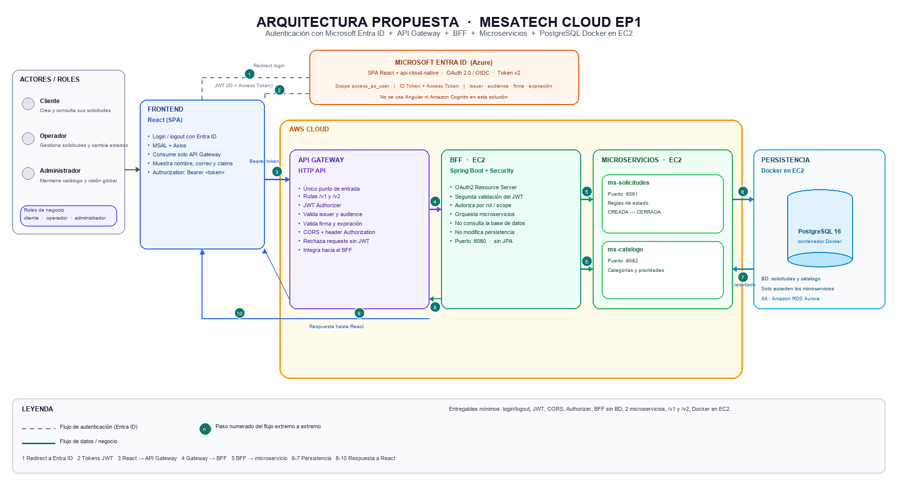
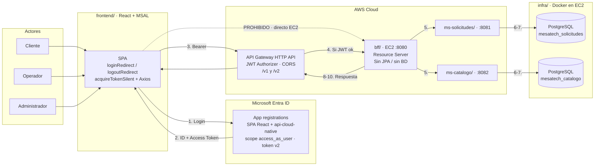
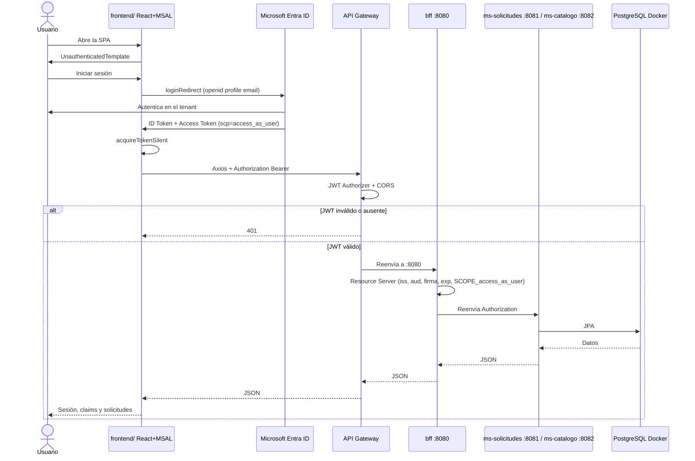
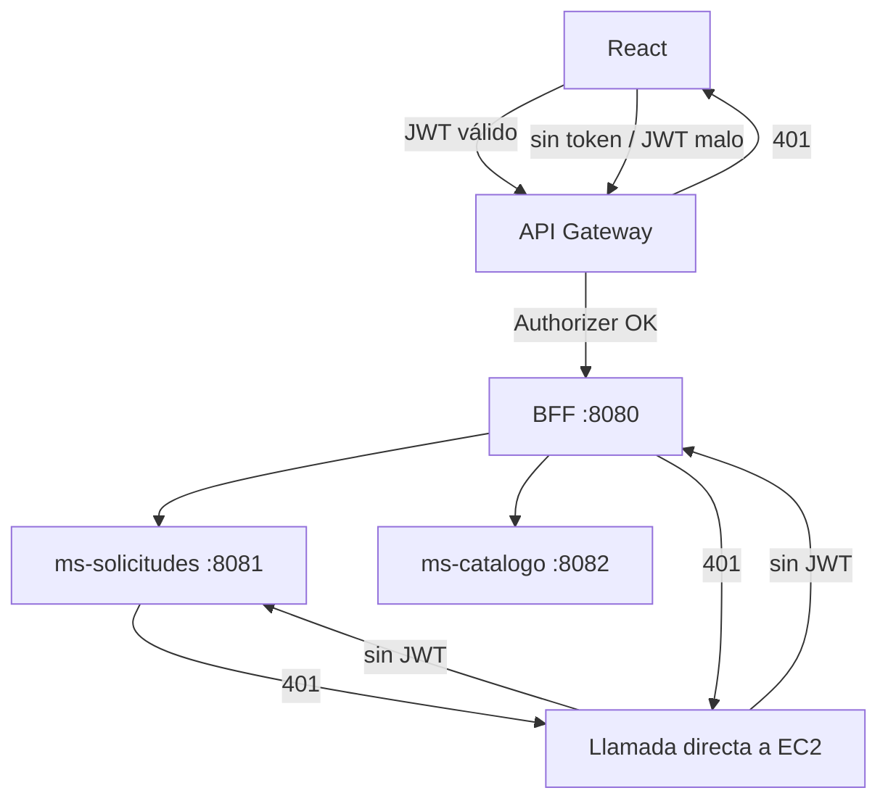
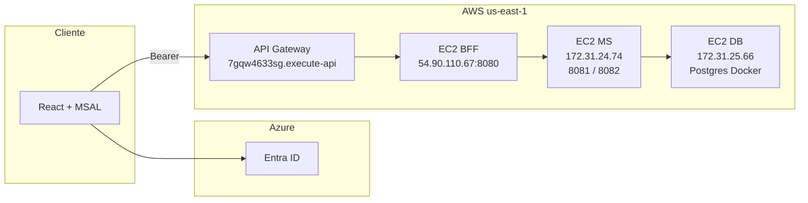
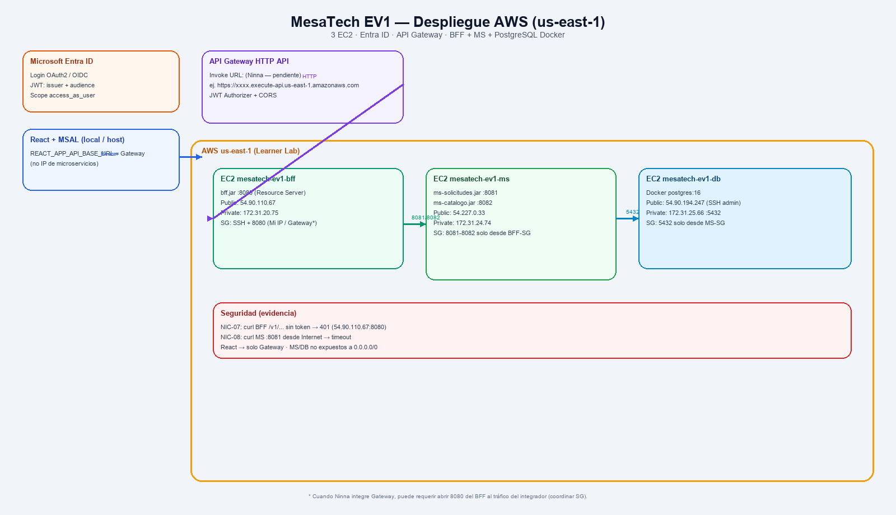

# Diagrama de arquitectura — MesaTech Cloud EP1

Arquitectura de la solución que vamos a entregar, alineada a la guía, a las anotaciones del profesor y al **monorepo ya creado**.

**IDaaS:** Microsoft Entra ID (Azure) · **Front:** React + MSAL + Axios · **Entrada:** AWS API Gateway · **Orquestación:** BFF Spring Boot · **Dominio:** `ms-solicitudes` + `ms-catalogo` · **Datos:** PostgreSQL 16 en Docker (EC2).

```text
React + MSAL  →  Entra ID (login / JWT)
React + MSAL  →  API Gateway  →  BFF :8080  →  ms-solicitudes :8081  →  PostgreSQL (mesatech_solicitudes)
                                         └→  ms-catalogo    :8082  →  PostgreSQL (mesatech_catalogo)
```

**Regla de seguridad:** React solo habla con API Gateway (en AWS) o, en local, con el BFF. Un acceso directo a `:8080`, `:8081` o `:8082` sin JWT válido responde **401**.



---

## Vista de componentes



---

## Mapeo al repositorio

| Caja del diagrama | Carpeta | Puerto | Persistencia |
| --- | --- | --- | --- |
| React + MSAL | `frontend/` | 3000 | No |
| Entra ID | Portal Azure (no es código) | — | Usuarios / apps del tenant |
| API Gateway | Consola AWS (HTTP API) | 443 | No |
| BFF | `bff/` | **8080** | **No** (solo reenvía) |
| Microservicio solicitudes | `ms-solicitudes/` | **8081** | `mesatech_solicitudes` |
| Microservicio catálogo | `ms-catalogo/` | **8082** | `mesatech_catalogo` |
| PostgreSQL Docker | `infra/docker-compose.yml` | 5432 | Las dos BD |

En **local**, `REACT_APP_API_BASE_URL=http://localhost:8080` (el BFF).  
En **AWS**, esa variable es la URL de **API Gateway**. Nunca la IP de un microservicio.

---

## Flujo extremo a extremo



Acceso directo a BFF o microservicio (sin Gateway, sin JWT) → **401**.

---

## APIs que expone el BFF (y el Gateway)

| Método | Ruta | Destino interno |
| --- | --- | --- |
| `GET` | `/public/hola` | BFF (sin JWT) |
| `GET` | `/api/usuario` | BFF (lee claims del JWT) |
| `POST` | `/v1/solicitudes` | `ms-solicitudes` |
| `GET` | `/v1/solicitudes/mias` | `ms-solicitudes` |
| `GET` | `/v1/solicitudes` | `ms-solicitudes` |
| `PATCH` | `/v1/solicitudes/{id}/estado` | `ms-solicitudes` |
| `GET` | `/v2/solicitudes/mias` | `ms-solicitudes` (contrato v2) |
| `GET` | `/v1/catalogo` | `ms-catalogo` |
| `POST` | `/v1/catalogo/categorias` | `ms-catalogo` |
| `POST` | `/v1/catalogo/prioridades` | `ms-catalogo` |

Regla de negocio: no se puede pasar a **RESUELTA** si el estado no es **EN_PROCESO**.

---

## Acceso permitido vs bloqueado



| Intento | Resultado |
| --- | --- |
| React → Gateway con JWT y `access_as_user` | 2xx |
| React → Gateway sin token o JWT vencido | **401** en el Gateway |
| Browser o curl a `:8080` / `:8081` / `:8082` sin Bearer | **401** |
| Front apuntando a un microservicio | No permitido |

---

## Qué hay en cada caja

| Zona | Componente | Qué hace |
| --- | --- | --- |
| Navegador | `frontend/` React + MSAL | Login/logout Entra ID, muestra nombre/correo/`oid`, Axios solo a `REACT_APP_API_BASE_URL`. |
| Azure | Microsoft Entra ID | Dos App Registrations (SPA + `api-cloud-native`), scope `access_as_user`, access token v2. |
| AWS | API Gateway HTTP API | Único entrypoint público. CORS, JWT Authorizer, rutas `/v1` y `/v2`. |
| EC2 | `bff/` :8080 | Segunda validación JWT. Orquesta. **Sin base de datos.** |
| EC2 | `ms-solicitudes/` :8081 | CRUD solicitudes + flujo de estados. |
| EC2 | `ms-catalogo/` :8082 | Categorías y prioridades. |
| EC2 | `infra/` PostgreSQL 16 Docker | Dos bases. Solo los microservicios escriben. Alternativa: Aurora. |

---

## Identidad (Entra ID)

| Registro | Uso en el código |
| --- | --- |
| SPA React | `REACT_APP_ENTRA_CLIENT_ID` / MSAL `clientId` |
| `api-cloud-native` | `ENTRA_AUDIENCE` en BFF y microservicios; scope `api://<API_CLIENT_ID>/access_as_user` |
| Tenant | `ENTRA_ISSUER_URI` = `https://login.microsoftonline.com/<TENANT>/v2.0` |

Spring valida **iss** (tenant) y **aud** (API). El claim `scp=access_as_user` se vuelve `SCOPE_access_as_user`.

---

## Adaptaciones respecto del diagrama oficial

| Diagrama de la guía | Esta solución |
| --- | --- |
| Angular + MSAL | **React + MSAL + Axios** (`frontend/`) |
| Microsoft Entra ID | **Microsoft Entra ID** (Cognito queda descartado) |
| Oracle Autonomous Database | **PostgreSQL 16 Docker en EC2** (`infra/`) |
| Pedidos / productos | **solicitudes** y **catálogo de soporte** |
| Un backend genérico | BFF `:8080` + dos MS `:8081` / `:8082` |

La topología de la guía se mantiene: identidad aparte, Gateway al frente, BFF en el medio, microservicios y persistencia detrás.

---

## Despliegue EV1 — 3 EC2 (equipo, us-east-1)

Topología elegida: **una EC2 por capa** (DB, MS, BFF). Región **us-east-1** (Learner Lab).

| Recurso | Name | IP pública | IP privada | Puertos |
| --- | --- | --- | --- | --- |
| PostgreSQL Docker | `mesatech-ev1-db` | `54.90.194.247` | `172.31.25.66` | 5432 (solo MS-SG) |
| Microservicios | `mesatech-ev1-ms` | `54.227.0.33` | `172.31.24.74` | 8081, 8082 (solo BFF-SG) |
| BFF | `mesatech-ev1-bff` | **`54.90.110.67`** | `172.31.20.75` | **8080** (integración Gateway) |

**Ninna (API Gateway):** integración HTTP hacia `http://54.90.110.67:8080`.  
**Invoke URL (front):** `REACT_APP_API_BASE_URL` = `https://7gqw4633sg.execute-api.us-east-1.amazonaws.com`.





Regenerar PNG (Windows, con Pillow):

```bash
python infra/scripts/draw-despliegue-ev1.py
```
