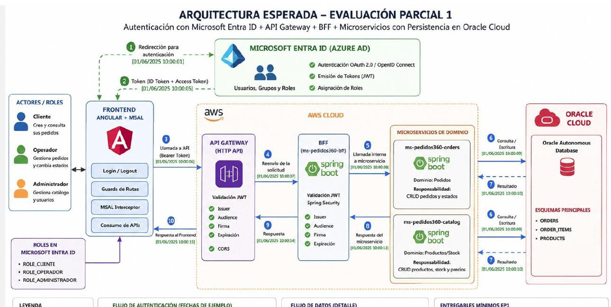

# DSY1107 - EP1 | Caso de negocio MesaTech Cloud

**DSY1107 - DESARROLLO CLOUD NATIVE I**

## Evaluación parcial n.° 1

**Caso de negocio**

# MesaTech Cloud

Plataforma cloud para gestión de solicitudes de soporte tecnológico

## Objetivo general

Diseñar e implementar una solución full stack que integre React, Microsoft Entra ID, AWS API Gateway y un backend Spring Boot desplegado en Amazon EC2, aplicando autenticación moderna, autorización, validación de tokens JWT, CORS, versionamiento de APIs e integración entre servicios.

**Trabajo grupal: mínimo 2, máximo 3 personas**

## Instrucciones generales de entregables

1. Debe entregar un informe pormenorizado con print de pantalla de cada paso que realice de la configuración de los servicios Cloud, tanto Azure como AWS, junto con evidencias de funcionamiento de su aplicación React usando también print de pantalla.
2. La presentación a realizar por su grupo debe mostrar un resumen de las configuraciones realizadas en Cloud (no todas las pantallas) y mostrar print de pantalla de su aplicación React demostrando el funcionamiento. Durante la ronda de preguntas, el docente comprobará el conocimiento adquirido por el alumno, lo que corresponderá a su nota de presentación.
3. No debe mostrar su aplicación funcionando en la presentación.
4. El docente puede solicitar al equipo que demuestre el funcionamiento el día de la presentación, donde solicitará subir los servicios y mostrar la aplicación funcional.

---

## 1. Contexto del caso de negocio

MesaTech es una empresa que presta soporte tecnológico a pequeñas y medianas organizaciones. Actualmente, las solicitudes de soporte se reciben por correo, teléfono y mensajería, lo que dificulta conocer el estado de cada atención, identificar al responsable y mantener trazabilidad sobre las acciones realizadas.

La empresa decidió construir **MesaTech Cloud**, una aplicación web que permita centralizar las solicitudes de soporte y que pueda ser utilizada por clientes, operadores de soporte y administradores. La organización exige que el acceso sea autenticado mediante **Microsoft Entra ID** y que ninguna API de negocio sea consumida directamente desde el frontend sin pasar por **AWS API Gateway**.

El sistema debe implementarse utilizando una arquitectura distribuida con frontend, API Gateway, un Backend for Frontend (BFF) y microservicios de dominio. El propósito de la evaluación es que el equipo aplique los mecanismos de identidad, seguridad e integración trabajados durante la unidad.

## 2. Desafío

El equipo ha sido contratado para construir un MVP funcional de MesaTech Cloud. La solución debe permitir que cada tipo de usuario realice acciones diferentes y debe proteger los endpoints mediante tokens emitidos por Microsoft Entra ID.

| Actor | Necesidad de negocio |
| --- | --- |
| **Cliente** | Crear solicitudes de soporte, consultar sus propias solicitudes y revisar su estado. |
| **Operador** | Consultar solicitudes asignadas o disponibles, actualizar estados y registrar la atención realizada. |
| **Administrador** | Mantener el catálogo de categorías/prioridades y disponer de una visión global de las solicitudes. |

## 3. Arquitectura de referencia obligatoria

La siguiente imagen corresponde a la arquitectura de referencia entregada para la evaluación. Debe utilizarse como patrón general de flujo e integración. El equipo debe adaptarla al dominio MesaTech Cloud y a React, sin incorporar servicios cloud adicionales que no formen parte del alcance definido en esta guía.



**Figura 1.** Arquitectura de referencia de la EP1.

### Adaptaciones obligatorias para esta evaluación

- El frontend será desarrollado con **React (Create React App) + MSAL**, no Angular.
- No se utilizará Oracle Cloud. La persistencia será implementada en AWS según las opciones indicadas en la sección 8.
- El BFF y los microservicios Spring Boot deben ejecutarse en **Amazon EC2**. El equipo puede utilizar una o más instancias EC2.
- No se evaluarán servicios AWS adicionales como Lambda, ECS, EKS, Cognito, S3, CloudFront, ALB o WAF.

## 4. Alcance funcional mínimo

### 4.1 Gestión de solicitudes de soporte

Una solicitud debe contener, como mínimo, un identificador, título, descripción, categoría, prioridad, usuario solicitante, estado y fecha de creación. El equipo puede agregar atributos adicionales si son necesarios para su solución.

| Acción | Cliente | Operador | Administrador |
| --- | --- | --- | --- |
| Crear una solicitud | Sí | Opcional | Opcional |
| Ver sus propias solicitudes | Sí | Sí | Sí |
| Ver todas las solicitudes | No | Sí | Sí |
| Cambiar estado | No | Sí | Sí |
| Gestionar catálogo | No | No | Sí |

### 4.2 Flujo de estados

El flujo mínimo de una solicitud será:

```text
CREADA → ASIGNADA → EN_PROCESO → RESUELTA → CERRADA
```

También se permitirá **CANCELADA** cuando corresponda. Como regla de negocio mínima, una solicitud no puede pasar a **RESUELTA** si antes no se encuentra **EN_PROCESO**.

## 5. Componentes que deben implementar

| Componente | Tecnología / servicio | Responsabilidad mínima |
| --- | --- | --- |
| **Frontend** | React + MSAL | Login/logout con Entra ID, obtención de tokens, visualización de sesión y consumo del API Gateway. |
| **Identidad** | Microsoft Entra ID | Tenant, registros de aplicaciones, usuarios de prueba, scopes/permisos y configuración necesaria para emitir tokens. |
| **API Manager** | AWS API Gateway - HTTP API | Punto de entrada al backend, rutas, CORS, JWT Authorizer e integración hacia el BFF. |
| **BFF** | Spring Boot + Spring Security en EC2 | Validar/autorización de JWT y coordinar las llamadas a los microservicios. No accede directamente a la base de datos. |
| **Microservicio 1** | Spring Boot en EC2 | Gestión de solicitudes de soporte y reglas de estado. |
| **Microservicio 2** | Spring Boot en EC2 | Catálogo de categorías y prioridades. |
| **Persistencia** | RDS o motor de BD en EC2 | Persistencia de solicitudes y catálogo. La alternativa elegida queda a decisión del equipo. |

## 6. Identidad y frontend React

El frontend debe tomar como base conceptual el ejercicio realizado previamente en React con MSAL. No se exige copiar el repositorio, pero sí demostrar que el equipo comprende y puede adaptar ese flujo a un caso de negocio distinto.

- Registrar/configurar la aplicación SPA en Microsoft Entra ID y utilizar correctamente Client ID, Tenant ID/Authority y Redirect URI.
- Integrar React con `@azure/msal-browser` y `@azure/msal-react`.
- Implementar inicio y cierre de sesión utilizando Microsoft Entra ID.
- Distinguir usuario autenticado y no autenticado en la interfaz.
- Obtener y utilizar un Access Token para invocar la API protegida.
- Mostrar al menos nombre y usuario/correo del usuario autenticado y permitir inspeccionar al menos un claim relevante del token.
- Solicitar los scopes requeridos por la API. Los nombres concretos de los scopes pueden ser definidos por el equipo, pero deben ser coherentes con las operaciones protegidas.

**Referencia del ejercicio realizado en clases:** el repositorio utilizado implementa `MsalProvider`, `useMsal`, `loginRedirect`/`logoutRedirect`, templates de autenticación y lectura de claims del usuario. La nueva solución debe aplicar estos conocimientos al dominio MesaTech Cloud, no limitarse a mostrar una pantalla de login.

## 7. AWS API Gateway

AWS API Gateway será el único punto de entrada utilizado por React para acceder a las funciones de negocio.

- Crear una HTTP API.
- Definir rutas para el módulo de solicitudes y para el catálogo.
- Configurar integración hacia el BFF desplegado en EC2.
- Configurar CORS para permitir el consumo desde el frontend React, incluyendo el header `Authorization` y los métodos HTTP utilizados.
- Configurar un JWT Authorizer utilizando los datos de Microsoft Entra ID que correspondan al issuer y audience de la API protegida.
- Demostrar que una solicitud sin token válido es rechazada antes de llegar a la lógica de negocio.

### 7.1 Versionamiento obligatorio

Las rutas de negocio deben publicar al menos una versión explícita de la API, por ejemplo `/v1/...`. Además, el equipo deberá mantener una segunda versión para al menos una operación, de forma que puedan coexistir `/v1` y `/v2` sin eliminar la versión anterior.

La modificación introducida en v2 será definida por el equipo. Puede agregar información o extender el contrato, pero debe quedar documentado qué cambió y por qué se mantuvo v1 disponible.

## 8. BFF, Spring Security y microservicios

- El BFF debe recibir las solicitudes provenientes de API Gateway y aplicar una segunda validación del JWT mediante Spring Security / OAuth2 Resource Server.
- La configuración debe validar los elementos de seguridad trabajados en clases, tales como issuer, audience, firma, expiración y permisos/scopes según corresponda.
- El BFF debe decidir si el usuario puede ejecutar la operación y luego llamar al microservicio correspondiente.
- El BFF no puede consultar ni modificar directamente la base de datos.
- Los microservicios deben implementar la lógica de negocio y persistencia de su dominio.
- El equipo deberá desplegar el BFF y los dos microservicios en Amazon EC2. Puede utilizar una sola instancia con distintos puertos o varias instancias; no se evaluará una topología de red avanzada.

### 8.1 Persistencia: decisión del equipo

La base de datos no está fijada por la evaluación. El equipo puede elegir una de estas alternativas:

- Amazon RDS con el motor de base de datos seleccionado por el grupo.
- Motor de base de datos instalado y ejecutándose dentro de una instancia EC2.

La elección debe justificarse brevemente. La evaluación se centrará en que exista persistencia funcional y que el acceso a datos sea realizado por los microservicios, no por el BFF ni por el frontend.

## 9. API mínima esperada

Los siguientes endpoints definen el mínimo funcional. El grupo puede proponer nombres equivalentes siempre que mantenga el mismo alcance y el versionamiento solicitado.

| Método | Ruta de ejemplo | Propósito |
| --- | --- | --- |
| `POST` | `/v1/solicitudes` | Crear una solicitud. |
| `GET` | `/v1/solicitudes/mias` | Consultar solicitudes del usuario autenticado. |
| `GET` | `/v1/solicitudes` | Consultar todas las solicitudes para perfiles autorizados. |
| `PUT` o `PATCH` | `/v1/solicitudes/{id}/estado` | Actualizar el estado respetando la regla de negocio. |
| `GET` | `/v1/catalogo` | Consultar categorías y prioridades. |
| `POST`/`PUT`/`DELETE` | `/v1/catalogo/...` | Mantener el catálogo para el administrador. |
| `GET` | `/v2/...` | Segunda versión de al menos una operación definida por el equipo. |

## 10. Flujo extremo a extremo que debe demostrarse

1. El usuario abre la aplicación React.
2. React presenta el estado no autenticado y permite iniciar sesión.
3. MSAL redirige al usuario a Microsoft Entra ID.
4. Entra ID autentica al usuario y devuelve los tokens correspondientes.
5. React reconoce la sesión autenticada y obtiene el Access Token necesario para la API.
6. React envía una solicitud con `Authorization: Bearer <access_token>` hacia AWS API Gateway.
7. API Gateway valida el JWT mediante el JWT Authorizer y aplica CORS.
8. API Gateway reenvía la solicitud al BFF en EC2.
9. El BFF valida nuevamente el token y aplica autorización.
10. El BFF invoca al microservicio correspondiente.
11. El microservicio ejecuta la regla de negocio y consulta o persiste datos.
12. La respuesta retorna hasta React y se presenta al usuario.

## 11. Pruebas mínimas obligatorias

| Prueba | Resultado esperado |
| --- | --- |
| Acceso sin autenticación | La operación protegida no puede completarse. |
| Solicitud a API Gateway sin token | La solicitud es rechazada. |
| JWT inválido o expirado | La solicitud es rechazada. |
| JWT válido y permisos suficientes | La operación autorizada se procesa correctamente. |
| Usuario intentando una acción no permitida | La operación es rechazada por autorización. |
| CORS desde React | El navegador permite el consumo desde el origen configurado. |
| Regla de estado inválida | El sistema impide resolver una solicitud que no está `EN_PROCESO`. |
| v1 y v2 | Ambas versiones seleccionadas continúan disponibles y responden según su contrato. |
| Persistencia | Los datos permanecen disponibles después de nuevas consultas. |

## 12. Entregables y evidencias

- Código fuente del frontend React y de los componentes backend desarrollados.
- Evidencia de la configuración de Microsoft Entra ID: App Registrations, Redirect URI y scopes/permisos utilizados. **No incluir secretos ni credenciales en la entrega.**
- Evidencia de la configuración de AWS API Gateway: HTTP API, rutas, integraciones, CORS y JWT Authorizer.
- Evidencia de despliegue del BFF y los dos microservicios en EC2.
- Evidencia de la alternativa de persistencia seleccionada.
- Demostración de login, logout, obtención/uso del Access Token y consumo de una API protegida desde React.
- Demostración de los escenarios de autorización y de las pruebas mínimas indicadas en esta guía.
- Breve diagrama de la solución implementada, identificando qué componente se ejecuta en cada servicio y qué rutas de comunicación se utilizaron.
- Código y configuraciones sin credenciales, client secrets, contraseñas ni otros datos sensibles versionados en el repositorio.

## 13. Fuera de alcance

Para evitar exigir contenidos o servicios que no forman parte del objetivo de esta evaluación, no se requiere implementar:

- Angular.
- Oracle Cloud u Oracle Autonomous Database.
- AWS Lambda, ECS, EKS, Cognito, S3, CloudFront, ALB o WAF.
- Infraestructura como código, CI/CD o Kubernetes.
- Arquitecturas de red privadas avanzadas, VPC Link o balanceadores.
- Alta disponibilidad, autoescalamiento o observabilidad avanzada.
- Un diseño visual complejo del frontend.

## 14. Qué se evaluará en la solución

| Área | Evidencia de dominio esperada |
| --- | --- |
| **React + MSAL** | Integra autenticación con Entra ID, administra el estado autenticado y utiliza Access Tokens para consumir la API. |
| **Microsoft Entra ID** | Configura correctamente la SPA y la API protegida, scopes/permisos y parámetros de identidad. |
| **JWT y Claims** | Comprende qué token utiliza para la API y demuestra validación/uso de claims relevantes. |
| **AWS API Gateway** | Configura HTTP API, rutas, integración, CORS, autorización JWT y versionamiento. |
| **Spring Security** | Protege el BFF como Resource Server y aplica validación/autorización coherente con Entra ID. |
| **Arquitectura** | Respeta el flujo React → Entra ID / API Gateway → BFF → microservicios → datos. |
| **Integración y negocio** | La solución funciona extremo a extremo y aplica las reglas del caso. |

## 15. Checklist antes de entregar

- [ ] La aplicación React permite iniciar y cerrar sesión con Microsoft Entra ID.
- [ ] React obtiene un Access Token válido para la API.
- [ ] El frontend consume el backend solamente a través de API Gateway.
- [ ] CORS está configurado y el consumo funciona desde el navegador.
- [ ] API Gateway rechaza peticiones sin un JWT válido.
- [ ] El BFF vuelve a validar el JWT y aplica autorización.
- [ ] El BFF llama a los microservicios y no accede directamente a la base de datos.
- [ ] Los dos microservicios funcionan y persisten información.
- [ ] Existe al menos una ruta v1 y una operación con coexistencia v1/v2.
- [ ] BFF y microservicios se encuentran desplegados en EC2.
- [ ] La solución demuestra diferencias reales entre los tipos de usuario.
- [ ] No existen secretos ni credenciales expuestos en el código o repositorio.
