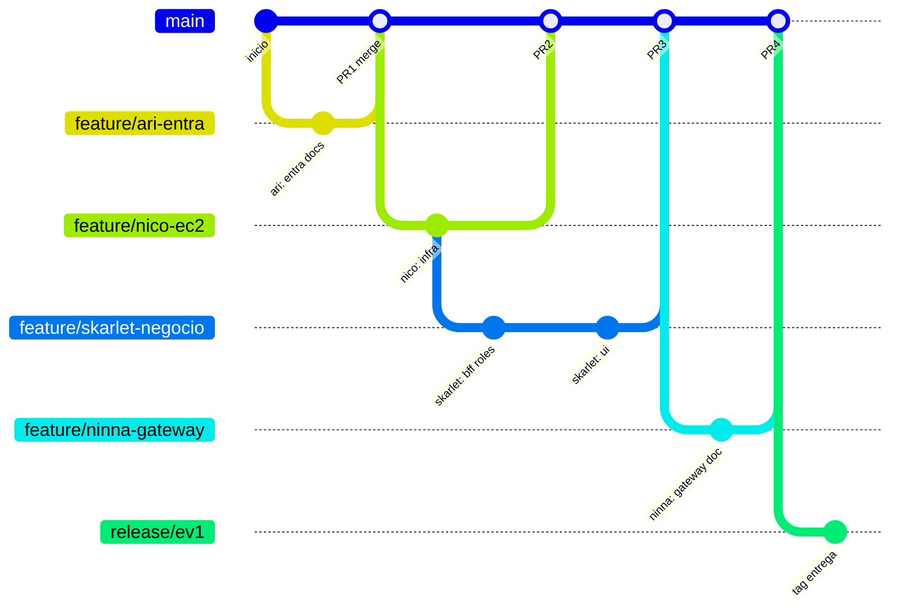

# Estrategia de branching — MesaTech Cloud EV1

Modelo Git para el monorepo `duoc-mesatech` con **4 integrantes** trabajando en paralelo (Ari, Ninna, Nico, Skarlet), alineado al [`plan-trabajo.md`](plan-trabajo.md) y al [`instructivo-maestro-ev1.md`](../guia/instructivo-maestro-ev1.md).

Remote de referencia: `origin` → repositorio del equipo en GitHub.

---

## 1. Ramas permanentes

| Rama | Propósito | Quién commitea | Reglas |
| --- | --- | --- | --- |
| **`main`** | Código **integrado** y demostrable; historial limpio para evaluación | Solo vía **PR merge** | Siempre compilable en local (BFF + MS + front); sin `.env` ni secretos |
| **`develop`** *(opcional)* | Integración continua antes de estabilizar `main` | PR desde features | Usar solo si `main` debe quedar “congelada” cerca de la entrega; si son 4 personas y pocos conflictos, **pueden omitir** `develop` y mergear features directo a `main` |

**Recomendación EV1 (equipo pequeño):** **`main` + ramas `feature/*`** sin `develop`, salvo que el docente exija una rama de entrega aparte.

---

## 2. Ramas temporales (nomenclatura)

### 2.1 Features por responsable (trabajo habitual)

```text
feature/<integrante>-<tema-corto>
```

| Integrante | Rama base sugerida | Ejemplos |
| --- | --- | --- |
| **Ari** | `feature/ari-entra` | `feature/ari-app-roles`, `feature/ari-env-docs` |
| **Ninna** | `feature/ninna-gateway` | `feature/ninna-cors`, `feature/ninna-marca`, `feature/ninna-doc-v1-v2` |
| **Nico** | `feature/nico-ec2` | `feature/nico-infra-compose`, `feature/nico-systemd`, `feature/nico-presentacion` |
| **Skarlet** | `feature/skarlet-negocio` | `feature/skarlet-bff-403`, `feature/skarlet-ui-solicitudes`, `feature/skarlet-informe-docs` |

### 2.2 Por capa técnica (si dos personas tocan lo mismo)

```text
feature/<capa>-<descripcion>
```

| Capa | Prefijo | Ejemplo |
| --- | --- | --- |
| Frontend | `feature/front-` | `feature/front-catalogo-admin` |
| BFF | `feature/bff-` | `feature/bff-autorizacion-roles` |
| MS solicitudes | `feature/ms-solicitudes-` | `feature/ms-solicitudes-estados` |
| MS catálogo | `feature/ms-catalogo-` | `feature/ms-catalogo-crud` |
| Docs / informe | `feature/docs-` | `feature/docs-capturas-ninna` |
| Infra | `feature/infra-` | `feature/infra-ec2-readme` |

### 2.3 Integración y entrega

| Rama | Cuándo |
| --- | --- |
| `release/ev1` | 1–2 semanas antes de entregar: solo fixes, capturas en docs, versiones finales de `env.example` |
| `hotfix/<tema>` | Desde `main`: arreglo urgente post-merge (401, CORS, typo en prod) |

**No usar:** nombres con secretos, `fix-profesor-ids`, ramas largas sin merge > 2 semanas.

---

## 3. Flujo de trabajo (GitHub Flow)



### Ciclo diario (cada integrante)

| Paso | Comando / acción |
| --- | --- |
| 1 | `git fetch origin` |
| 2 | `git checkout main && git pull origin main` |
| 3 | `git checkout -b feature/<tu-rama>` *(o pull de rama existente)* |
| 4 | Commits pequeños y descriptivos (español) |
| 5 | `git push -u origin feature/<tu-rama>` |
| 6 | Abrir **Pull Request** → `main` |
| 7 | Revisión cruzada → merge |
| 8 | Borrar rama remota tras merge (opcional, recomendado) |

---

## 4. Orden de merge recomendado (dependencias)

Respetar el orden lógico reduce conflictos y “main roto”.

```text
Fase 0 — docs + esqueleto (cualquiera, PR chicos)
    ↓
1) feature/ari-*     → env.example, docs Entra, sin IDs reales
    ↓
2) feature/skarlet-* (paralelo temprano) → autorización BFF + UI local :8080
3) feature/nico-*    → infra/, scripts despliegue, docs EC2
    ↓
4) feature/ninna-*   → docs Gateway, README REACT_APP_API_BASE_URL, assets marca
    ↓
5) Integración       → Skarlet: front apunta a Gateway; pruebas E2E
    ↓
6) release/ev1       → congelar, checklist §15, tag ev1.0.0
```

| Bloqueo | Rama que espera | Rama que desbloquea |
| --- | --- | --- |
| JWT Authorizer (doc/config Ninna) | `feature/ninna-gateway` | `feature/ari-entra` mergeado (issuer/audience en docs privados, no en git) |
| E2E cloud | `feature/skarlet-*` final | Nico EC2 + Ninna Invoke URL documentada en PR |
| CORS + SG | PR que toque `SecurityConfig` | Coordinar **Nico + Ninna** en mismo PR o merges seguidos |

---

## 5. Alcance por carpeta (evitar pisarse)

| Carpeta | Owner principal | Otros (coordinar PR) |
| --- | --- | --- |
| `frontend/` | Skarlet | Ninna (marca), Ari (solo si MSAL scope) |
| `bff/` | Skarlet (auth negocio) | Nico (CORS host Gateway) |
| `ms-solicitudes/` | Skarlet | — |
| `ms-catalogo/` | Skarlet | — |
| `infra/` | Nico | — |
| `docs/equipo/guias/` | Quien escribe su guía | Skarlet integra informe |
| `docs/assets/marca/` | Ninna | Skarlet consume en front |
| `env.example`, `frontend/.env.example` | Ari propone | **1 PR conjunto** o Ari mergea primero |

**Archivos conflictivos frecuentes:** `bff/.../SecurityConfig.java`, `frontend/src/App.js`, `README.md`, `env.example` → avisar en chat antes de editar.

---

## 6. Pull Requests

### 6.1 Tamaño

| Tipo | Líneas orientativas | Ejemplo |
| --- | --- | --- |
| Ideal | &lt; 400 | Un controller, una pantalla, un capítulo doc |
| Aceptable | &lt; 800 | UI + BFF mismo feature |
| Dividir | &gt; 800 | Separar front y back en 2 PR |

### 6.2 Plantilla de PR (copiar en descripción)

```markdown
## Qué hace
- ...

## Bloque EV1
- [ ] A / B / C / D / E / F / G / H / P (marcar)

## Cómo probar
1. ...
2. ...

## Capturas
- [ ] Informe: IDs ARI/NIN/NIC/SKA (si aplica)

## Checklist
- [ ] Sin .env, .pem, tokens ni IDs del profesor
- [ ] `mvn` / `npm start` OK en local (quien aplique)
```

### 6.3 Revisores sugeridos

| Cambio en | Revisor mínimo |
| --- | --- |
| `bff/`, JWT, roles | Ari o Skarlet |
| `infra/`, despliegue, SG docs | Nico |
| Gateway, CORS, `REACT_APP_*` docs | Ninna |
| `frontend/`, pruebas negocio | Skarlet |
| Solo docs propios | Cualquier otro integrante |

**Regla:** nadie mergea su propio PR sin al menos **1 aprobación** de otro integrante.

---

## 7. Commits

Formato **obligatorio** del equipo:

```text
[ TIPO ]: Detalle del commit
```

| Regla | Detalle |
| --- | --- |
| Idioma | Español |
| `TIPO` | Mayúsculas entre corchetes (ver tabla) |
| Detalle | Frase clara; una idea por commit |
| Prohibido en commit | `.env`, tokens, IDs del profesor, archivos generados |

| TIPO | Cuándo usarlo |
| --- | --- |
| `FEAT` | Nueva funcionalidad (React, BFF, MS) |
| `FIX` | Corrección de error |
| `DOCS` | Documentación e informe en repo |
| `CHORE` | Tareas de mantenimiento del repo |
| `REFACTOR` | Refactor sin cambio funcional |
| `TEST` | Pruebas automatizadas o fixtures |

| Ejemplo válido |
| --- |
| `[ FEAT ]: Agregar PATCH de estado en ms-solicitudes` |
| `[ DOCS ]: Estrategia de branching y convención de commits` |
| `[ FIX ]: Validar audience JWT en EC2` |

Texto oficial para todo el equipo: [`reglas-repositorio.md`](reglas-repositorio.md) §2. Misma normativa en `.cursor/rules/mesatech-git-workflow.mdc`.

---

## 8. Cronograma de ramas ↔ fases EV1

| Semana | Fases | Ramas activas esperadas |
| --- | --- | --- |
| 1 | 0, A, inicio E | `feature/ari-entra`, `feature/skarlet-negocio` |
| 2 | C, D, B (parcial), H | `feature/nico-ec2`, `feature/ninna-marca`, `feature/ninna-gateway` |
| 3 | E cloud, F, G, P | `feature/skarlet-*`, merges a `main`, `release/ev1` |
| Entrega | Tag + informe | `main` @ tag `ev1.0.0`; opcional `release/ev1` → merge → tag |

---

## 9. Entrega final (tag y rama)

| Paso | Acción |
| --- | --- |
| 1 | `main` cumple checklist §15 en [`../caso/ep1-guia-oficial.md`](../caso/ep1-guia-oficial.md) |
| 2 | Crear rama `release/ev1` desde `main` *(opcional)* |
| 3 | Solo commits `fix:` / `docs:` de cierre en `release/ev1` |
| 4 | Merge `release/ev1` → `main` |
| 5 | Tag anotado: `git tag -a ev1.0.0 -m "Entrega EP1 MesaTech Cloud"` |
| 6 | `git push origin main --tags` |
| 7 | Informe y PPT **fuera del repo** o solo docs sin secretos |

El código entregable al docente = **`main`** en el commit del tag (o último commit de `main` acordado).

---

## 10. Qué no va en Git (refuerzo)

| Item | Dónde vive |
| --- | --- |
| `.env`, `frontend/.env` | Local |
| `.pem` EC2 | Local / gestor equipo |
| Capturas informe con tokens | Carpeta informe Drive |
| Config AWS/Azure con secretos | Consolas cloud |
| API Gateway / Entra “estado real” | Consolas; en repo solo **documentación** |

---

## 11. Comandos de referencia

```bash
# Actualizar main y crear rama
git checkout main
git pull origin main
git checkout -b feature/nico-ec2

# Subir y abrir PR (GitHub CLI)
git push -u origin feature/nico-ec2
gh pr create --base main --title "docs: guía despliegue EC2" --body "..."

# Tras merge: limpiar local
git checkout main
git pull origin main
git branch -d feature/nico-ec2

# Tag entrega
git tag -a ev1.0.0 -m "Entrega EP1 MesaTech Cloud"
git push origin ev1.0.0
```

---

## 12. Checklist acuerdo del equipo

- [ ] Todos tienen acceso **write** al repo `origin`
- [ ] Rama por defecto en GitHub: **`main`**
- [ ] Regla: PR + 1 revisión antes de merge
- [ ] Cada uno conoce su `feature/<nombre>-*` principal
- [ ] `env.example` actualizado en un PR acordado (Ari + Skarlet)
- [ ] Tag `ev1.0.0` en fecha de entrega

---

## Documentos relacionados

- [`plan-trabajo.md`](plan-trabajo.md) — reparto y dependencias
- [`convenciones-desarrollo.md`](convenciones-desarrollo.md) — reglas de código
- [`guias/README.md`](guias/README.md) — paso a paso por persona
