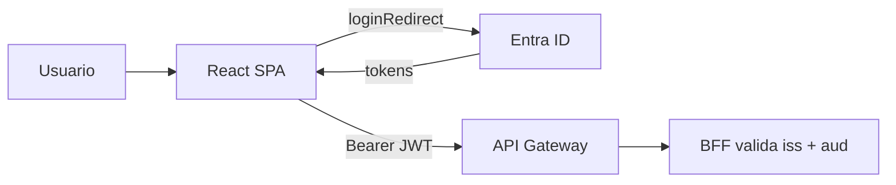

# Guía paso a paso — Ari (Identidad en Microsoft Entra ID)

**Tu misión:** configurar el “login” de MesaTech Cloud para que React obtenga tokens y el backend pueda confiar en ellos.

**Bloque del plan:** A — Identidad (Azure).

**Cuándo avisar al equipo:** cuando tengas listos issuer, audience, scope y usuarios de prueba por rol.

---

## Estado EV1 (Ari) — 2026-09-17

Portal Entra (Parte A de [`../../guia/entra-spring-react.md`](../../guia/entra-spring-react.md) + roles de negocio) **hecho**. Falta **probar en local** con el monorepo, **confirmar el handoff** al equipo y **capturas** para el informe.

| Ítem | Estado |
| --- | --- |
| SPA React (`SPA React App`) + redirect local | Hecho (confirmar URI `http://localhost:3000/` con barra final) |
| API `api-cloud-native`, scope `access_as_user`, consentimiento admin, token v2 | Hecho |
| App roles `cliente` / `operador` / `administrador` + 3 usuarios asignados | Hecho |
| IDs en `.env` **local** (no Git) | Hecho |
| `frontend/.env` con `REACT_APP_*` literales | **Pendiente** |
| Login + `GET /api/usuario` + claim `roles` en jwt.ms | **Pendiente** |
| Mensaje al equipo (issuer, audience, UPN de demo, claim `roles`) | **Pendiente de confirmar** |
| Capturas ARI-01 … ARI-10 | **Pendiente** |
| Redirect URI de producción (cuando exista URL del front) | Más adelante (Ninna/Skarlet) |

**No hacer:** crear un Spring Boot nuevo (pasos 12–15 de la PPT) ni un React aparte (16–19). El Resource Server es `bff/`; el front es `frontend/`.

Siguiente acción concreta: §9 de esta guía (probar local) → §10 (handoff) → §11 (capturas).

---

## 0. Conceptos mínimos (léelos una vez)

| Concepto | En palabras simples | Analogía |
| --- | --- | --- |
| **Microsoft Entra ID** | Servicio de Microsoft donde viven usuarios y “apps” del login. | Portería del edificio: valida quién eres. |
| **Tenant** | Tu “organización” en Entra (la del equipo o la gratuita de estudiantes). | El edificio completo. |
| **App Registration** | Registro de una aplicación (React o API) en Entra. | Ficha de una app en la portería. |
| **SPA** | Frontend React en el navegador. | La pantalla donde el usuario hace clic en “Iniciar sesión”. |
| **API (`api-cloud-native`)** | Backend lógico que **expone permisos**; su Client ID es el **audience** del token. | El carnet dice “puede entrar a esta API”. |
| **Scope `access_as_user`** | Permiso que pide React para llamar a la API en nombre del usuario. | “Puedo usar MesaTech en tu nombre”. |
| **JWT / Access Token** | Texto firmado que lleva el navegador en `Authorization: Bearer …`. | Credencial temporal con fecha de vencimiento. |
| **Issuer (`iss`)** | URL que identifica quién emitió el token. | Sello de la portería. |
| **Audience (`aud`)** | Para qué API sirve el token (Client ID de la API). | Nombre del edificio destino. |



---

## 1. Antes de empezar (checklist previo)

| # | Requisito | Cómo comprobarlo |
| --- | --- | --- |
| 1 | Cuenta con acceso al **portal Azure** | Abrir [portal.azure.com](https://portal.azure.com) |
| 2 | Permiso para **Registrar aplicaciones** | Menú Entra ID → Registros de aplicaciones (sin error de acceso) |
| 3 | Repo clonado | Carpeta `duoc-mesatech` en tu PC |
| 4 | Canal con el equipo | WhatsApp/Teams para enviar IDs (**nunca** por commit en Git) |

**Documento detallado con capturas (PPT del curso):** [`../../guia/entra-spring-react.md`](../../guia/entra-spring-react.md) — úsalo junto con esta guía.

---

## 2. Mapa de tu trabajo (orden obligatorio)

```text
Paso 1–2   Registrar SPA React (si no existe) + API api-cloud-native     HECHO
Paso 3     Exponer scope access_as_user en la API                         HECHO
Paso 4     Dar permiso a la SPA + consentimiento de administrador        HECHO
Paso 5     Manifiesto: access token versión 2                             HECHO
Paso 6     Roles cliente / operador / administrador + usuarios de prueba HECHO
Paso 7     Probar login local con el equipo (Skarlet/Nico levantan backend)  PENDIENTE
Paso 8     Entregar variables + capturas para informe                     PENDIENTE
```

---

## 3. Paso 1 — SPA React en Entra

### 3.1 Objetivo

Que Microsoft sepa que `http://localhost:3000` (y luego la URL de producción) puede recibir al usuario después del login.

### 3.2 Subpasos

| Sub | Acción en portal | Detalle |
| --- | --- | --- |
| 1.1 | **Entra ID** → **Registros de aplicaciones** → **Nuevo registro** | Nombre ej.: `MesaTech React SPA` |
| 1.2 | Tipo de cuenta | “Solo cuentas de este directorio” (tenant del equipo) |
| 1.3 | **Redirect URI** | Plataforma: **Single-page application (SPA)** → `http://localhost:3000/` |
| 1.4 | Guardar | Anotar **Id. de aplicación (cliente)** → será `ENTRA_SPA_CLIENT_ID` / `REACT_APP_ENTRA_CLIENT_ID` |
| 1.5 | **Autenticación** | Confirmar URI SPA; agregar URI de producción cuando Ninna/Skarlet la tengan |
| 1.6 | **Id. de directorio (tenant)** | Anotar → `ENTRA_TENANT_ID` / `REACT_APP_ENTRA_TENANT_ID` |

### 3.3 Errores frecuentes

| Síntoma | Causa probable | Solución |
| --- | --- | --- |
| `AADSTS50011` redirect URI | URI no coincide exactamente | Debe ser `http://localhost:3000/` (barra final según portal) |
| Login abre pero falla en silencio | SPA mal registrada | Revisar plataforma **SPA**, no “Web” clásica |

---

## 4. Paso 2 — Registrar la API `api-cloud-native`

| Sub | Acción | Detalle |
| --- | --- | --- |
| 2.1 | **Nuevo registro** | Nombre: `api-cloud-native` |
| 2.2 | Redirect URI | **Dejar vacío** (es API, no navegador) |
| 2.3 | Anotar Client ID | → `ENTRA_API_CLIENT_ID` y **`ENTRA_AUDIENCE`** (Spring y Gateway usan este valor) |

---

## 5. Paso 3 — Exponer la API y crear el scope

| Sub | Acción | Detalle |
| --- | --- | --- |
| 3.1 | App `api-cloud-native` → **Exponer una API** | **Establecer** si es la primera vez |
| 3.2 | URI de id. de aplicación | `api://<API_CLIENT_ID>` (portal puede sugerirlo) |
| 3.3 | **Agregar un ámbito** | Nombre visible: `Access as user`; nombre scope: `access_as_user` |
| 3.4 | ¿Quién puede consentir? | Admins y usuarios (como indique la PPT del curso) |
| 3.5 | Scope completo para React | `api://<API_CLIENT_ID>/access_as_user` → `REACT_APP_ENTRA_API_SCOPE` |

---

## 6. Paso 4 — Permisos de la SPA sobre la API

| Sub | Acción | Detalle |
| --- | --- | --- |
| 4.1 | Abrir registro **SPA React** → **Permisos de API** | |
| 4.2 | **Agregar permiso** → **Mis API** → `api-cloud-native` | |
| 4.3 | Permisos delegados | Marcar `access_as_user` |
| 4.4 | **Conceder consentimiento de administrador** | Botón verde; debe quedar “Concedido” |

Sin este paso, React no obtiene access token para la API.

---

## 7. Paso 5 — Access token versión 2 (manifiesto)

| Sub | Acción | Detalle |
| --- | --- | --- |
| 5.1 | App **SPA** → **Manifiesto** | JSON editable |
| 5.2 | Buscar `requestedAccessTokenVersion` | Cambiar a **`2`** |
| 5.3 | Guardar | Repetir en **API** si el curso lo exige (revisar PPT) |

---

## 8. Paso 6 — Roles de negocio (cliente, operador, administrador)

**Recomendación del equipo:** App roles en la API `api-cloud-native`.

| Sub | Acción | Detalle |
| --- | --- | --- |
| 6.1 | `api-cloud-native` → **Roles de aplicación** → **Crear rol** | Valor: `cliente`, `operador`, `administrador` (display name claro) |
| 6.2 | **Enterprise applications** → tu API → **Usuarios y grupos** | Asignar usuarios de prueba a cada rol |
| 6.3 | Documentar para Skarlet | Los roles suelen aparecer en claim `roles` del JWT (probar en [jwt.ms](https://jwt.ms) pegando un token de prueba) |

**Alternativa:** grupos de Entra; coordinar con Skarlet cómo leer el claim.

---

## 9. Paso 7 — Probar que todo funciona (con el repo)

Pide a un compañero que levante Postgres + BFF (o hazlo tú siguiendo [`../../onboarding/refs-y-entorno.md`](../../onboarding/refs-y-entorno.md) §6).

| Sub | Acción | Resultado esperado |
| --- | --- | --- |
| 7.1 | Crear `frontend/.env` con tus IDs | Sin UUID del profesor |
| 7.2 | `npm start` en `frontend/` | Pantalla MesaTech |
| 7.3 | Clic **Iniciar sesión** | Redirect a Microsoft y vuelta logueado |
| 7.4 | Botón que llama `/api/usuario` | JSON con nombre, `oid`, etc. |
| 7.5 | Decodificar access token en jwt.ms | `aud` = API Client ID; `scp` o roles visibles |

Variables que el backend necesita (exportar antes de `mvn spring-boot:run`):

```text
ENTRA_ISSUER_URI=https://login.microsoftonline.com/<TENANT_ID>/v2.0
ENTRA_AUDIENCE=<API_CLIENT_ID>
```

---

## 10. Paso 8 — Entregar al equipo (plantilla de mensaje)

Copia esto en el chat privado (rellena valores):

```text
MesaTech — Entra ID listo
ENTRA_TENANT_ID=
ENTRA_SPA_CLIENT_ID=
ENTRA_API_CLIENT_ID=
ENTRA_ISSUER_URI=https://login.microsoftonline.com/<TENANT>/v2.0
ENTRA_AUDIENCE=<mismo que API CLIENT ID>
REACT_APP_ENTRA_API_SCOPE=api://<API_CLIENT_ID>/access_as_user

Usuarios de prueba:
- cliente: ...
- operador: ...
- admin: ...

Para Gateway (Ninna): issuer = ENTRA_ISSUER_URI, audience = ENTRA_API_CLIENT_ID
```

| Destinatario | Qué necesita de ti |
| --- | --- |
| **Ninna** | Issuer + Audience para JWT Authorizer |
| **Nico** | Mismas variables para EC2 |
| **Skarlet** | Usuarios por rol + cómo viene el rol en el JWT |
| **Todos** | Confirmación de que `env.example` coincide (solo placeholders en Git) |

---

## 11. Capturas para la rúbrica (paso a paso)

Reglas generales: [`COMO-HACER-CAPTURAS.md`](COMO-HACER-CAPTURAS.md).  
Cubre EP1 §12 (Entra ID), §14 (Entra + JWT/Claims) y aporta a §15 (login, access token).

Entrega a **Skarlet:** carpeta `capturas/ari/` con archivos `ARI-01.png` … y textos de pie de figura.

| ID | Rúbrica / checklist §15 | Qué demuestra |
| --- | --- | --- |
| ARI-01 | §12 Entra — App Registrations | Existen SPA + API del **equipo** |
| ARI-02 | §12 Redirect URI | SPA configurada para React |
| ARI-03 | §12 scopes/permisos | Scope `access_as_user` expuesto |
| ARI-04 | §12 permisos SPA | Consentimiento admin concedido |
| ARI-05 | §14 parámetros identidad | Access token **versión 2** |
| ARI-06 | §15 roles / negocio | App roles y usuarios asignados |
| ARI-07 | §12 + §15 login | Pantalla Microsoft al iniciar sesión |
| ARI-08 | §14 JWT y claims | React: usuario autenticado + datos de `/api/usuario` |
| ARI-09 | §14 access token (uso) | Claims en jwt.ms **sin** pegar token en informe |
| ARI-10 | §15 logout | Sesión cerrada en React |

### ARI-01 — Listado de aplicaciones

| Paso | Acción |
| --- | --- |
| 1 | [portal.azure.com](https://portal.azure.com) → **Microsoft Entra ID** |
| 2 | **Registros de aplicaciones** → **Todas las aplicaciones** |
| 3 | Captura donde se vean **dos** apps: SPA MesaTech + `api-cloud-native` |
| 4 | Incluir columna **Id. de aplicación (cliente)** (UUID visibles OK) |

**No mostrar:** menús laterales con datos personales innecesarios; otros tenants.

---

### ARI-02 — Redirect URI de la SPA

| Paso | Acción |
| --- | --- |
| 1 | Abrir registro **SPA React** |
| 2 | **Autenticación** → plataforma **Single-page application** |
| 3 | Captura con `http://localhost:3000/` (y producción si ya existe) |

**Pie sugerido:** “Redirect URI SPA alineado a React (MSAL), EP1 §12”.

---

### ARI-03 — Exponer API y scope

| Paso | Acción |
| --- | --- |
| 1 | Abrir **`api-cloud-native`** → **Exponer una API** |
| 2 | Captura **URI de id. de aplicación** `api://...` |
| 3 | Captura (o segunda imagen) del ámbito **`access_as_user`** en la tabla de scopes |

---

### ARI-04 — Permisos de API en la SPA + consentimiento

| Paso | Acción |
| --- | --- |
| 1 | Registro **SPA** → **Permisos de API** |
| 2 | Debe aparecer `api-cloud-native` / `access_as_user` |
| 3 | Estado **✔ Concedido** para el tenant (consentimiento administrador) |
| 4 | Si hay botón gris antes de conceder: captura **antes y después** (opcional, refuerzo informe) |

---

### ARI-05 — Manifiesto token v2

| Paso | Acción |
| --- | --- |
| 1 | SPA → **Manifiesto** |
| 2 | Buscar (`Ctrl+F`) `requestedAccessTokenVersion` |
| 3 | Captura línea con valor **`2`** |

Repetir en API si configuraste v2 también ahí.

---

### ARI-06 — Roles de aplicación

| Paso | Acción |
| --- | --- |
| 1 | `api-cloud-native` → **Roles de aplicación** |
| 2 | Captura tabla con `cliente`, `operador`, `administrador` (o nombres elegidos) |
| 3 | **Enterprise applications** → app → **Usuarios y grupos** → captura asignaciones |

Demuestra §15 “diferencias por tipo de usuario” (base en identidad).

---

### ARI-07 — Login Entra (flujo)

| Paso | Acción |
| --- | --- |
| 1 | React en `localhost:3000`, **sin** sesión |
| 2 | Clic **Iniciar sesión** |
| 3 | Captura pantalla Microsoft (cuenta/correo institucional OK; password **no**) |

---

### ARI-08 — React autenticado + claims API

| Paso | Acción |
| --- | --- |
| 1 | Tras login, captura React mostrando nombre / email / oid (como expone la app) |
| 2 | Disparar acción que llame **`GET /api/usuario`** (botón o sección existente) |
| 3 | Captura JSON **parcial** (claims relevantes: `name`, `preferred_username`, `roles` si hay) |

**No mostrar:** header `Authorization` completo en DevTools.

---

### ARI-09 — Claims del access token (jwt.ms)

| Paso | Acción |
| --- | --- |
| 1 | Obtener access token solo para prueba local (DevTools → Network → copiar **sin** guardar en Git) |
| 2 | Pegar en [https://jwt.ms](https://jwt.ms) en tu PC |
| 3 | Captura payload: `aud`, `iss`, `scp` o `roles`, `exp` |
| 4 | **Borrar** token del portapapeles después |

En el informe: captura de jwt.ms; **no** insertar el string del token en Word.

---

### ARI-10 — Logout

| Paso | Acción |
| --- | --- |
| 1 | Clic **Cerrar sesión** en React |
| 2 | Captura vista no autenticada + mensaje MSAL si aparece |

---

### Checklist capturas Ari

- [ ] ARI-01 … ARI-10 guardadas con nombres estándar
- [ ] Ninguna captura con secretos ni Bearer completo
- [ ] Pies de figura redactados para Skarlet
- [ ] 2–3 imágenes seleccionadas para **presentación** (Nico)

Portal (ARI-01 … ARI-06) se puede capturar ya. Login / jwt.ms / logout (ARI-07 … ARI-10) requieren el paso 7 (front + BFF en local).

---

## 12. Checklist final Ari

- [x] SPA registrada con redirect `http://localhost:3000/`
- [x] API `api-cloud-native` registrada
- [x] Scope `access_as_user` expuesto y consentido
- [x] Token versión 2 en manifiesto
- [x] Tres roles/usuarios distinguibles
- [ ] Login + `/api/usuario` OK en local
- [ ] Variables enviadas por canal privado (confirmar que Nico, Ninna y Skarlet las tienen)
- [ ] Capturas guardadas para informe (Skarlet integra)

---

## 13. Si te bloqueas

| Problema | Revisar |
| --- | --- |
| No ves “Conceder consentimiento admin” | Necesitas rol Admin en el tenant |
| Backend responde 401 con token “válido” | `ENTRA_AUDIENCE` debe ser Client ID de la **API**, no de la SPA |
| Scope missing en token | Permisos API + consentimiento en SPA |

Glosario: [`../../glosario/README.md`](../../glosario/README.md).
