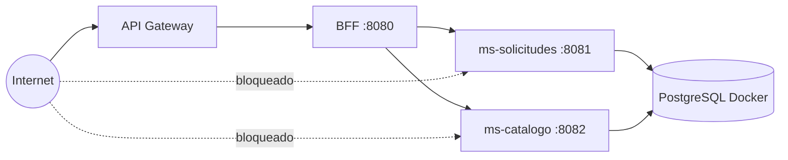

# Guía paso a paso — Nico (EC2, seguridad y presentación)

**Tu misión:** subir BFF, microservicios y PostgreSQL a AWS; cerrar puertos para que solo Gateway llegue al BFF; demostrar **401** directo; armar la **presentación oral** del grupo.

**Bloques del plan:** C (despliegue), D (seguridad), P (presentación).

---

## 0. Conceptos mínimos

| Concepto | En palabras simples |
| --- | --- |
| **EC2** | Un computador Linux en la nube (tu “servidor”). |
| **Security Group (SG)** | Firewall: qué puertos aceptan conexiones y desde dónde. |
| **SSH** | Forma de entrar al servidor por terminal (puerto 22). |
| **Docker Compose** | Levanta PostgreSQL en contenedor en ese servidor. |
| **JAR** | Archivo ejecutable Java (`mvn package`). |
| **BFF :8080** | Puerta que Ninna conectará al Gateway. |
| **MS :8081 / :8082** | Solo el BFF debe hablar con ellos, no Internet. |



---

## 1. Prerrequisitos

| # | Item | Fuente |
| --- | --- | --- |
| 1 | `ENTRA_ISSUER_URI`, `ENTRA_AUDIENCE` | Ari |
| 2 | Cuenta AWS + permiso EC2 | Equipo |
| 3 | Java 17 y Maven en tu PC (para compilar) | Instalación local |
| 4 | Par de claves `.pem` para SSH | Crear al lanzar EC2 — **no subir a Git** |
| 5 | Repo `duoc-mesatech` | Git clone |

---

## PARTE C — Despliegue en EC2

### Paso C.1 — Decidir topología

| Opción | Ventaja | Desventaja |
| --- | --- | --- |
| **1 EC2** con 8080+8081+8082+Docker | Más barato, simple para EV1 | Todo cae junto si falla la instancia |
| **Varias EC2** | Más “real” | Más configuración de red |

**Para EV1:** una instancia suele bastar. Documenta la decisión en 1 párrafo para el informe.

---

### Paso C.2 — Lanzar la instancia EC2

| Sub | Acción | Detalle |
| --- | --- | --- |
| C.2.1 | EC2 → **Launch instance** | Nombre `mesatech-ev1` |
| C.2.2 | AMI | Ubuntu 22.04 LTS (o Amazon Linux — ajusta comandos) |
| C.2.3 | Tipo | `t2.micro` / `t3.small` (free tier si aplica) |
| C.2.4 | Key pair | Crear/descargar `.pem` → guardar fuera del repo |
| C.2.5 | Security group inicial | SSH (22) solo **tu IP**; luego afinarás 8080 |
| C.2.6 | Storage | 20–30 GB |
| C.2.7 | Launch | Anotar **IP pública** |

---

### Paso C.3 — Conectar por SSH

PowerShell (Windows):

```powershell
ssh -i "C:\ruta\mesatech.pem" ubuntu@<IP_PUBLICA>
```

| Sub | Si falla | Revisar |
| --- | --- | --- |
| C.3.1 | Permission denied | Usuario `ubuntu` vs `ec2-user` según AMI |
| C.3.2 | Timeout | SG no permite 22 desde tu IP |

---

### Paso C.4 — Instalar software en la EC2

En la sesión SSH (Ubuntu):

| Sub | Comando / acción |
| --- | --- |
| C.4.1 | `sudo apt update && sudo apt upgrade -y` |
| C.4.2 | Instalar Java 17: `sudo apt install openjdk-17-jdk -y` → `java -version` |
| C.4.3 | Instalar Docker: [documentación oficial Docker Engine Ubuntu](https://docs.docker.com/engine/install/ubuntu/) |
| C.4.4 | Docker Compose plugin: `sudo apt install docker-compose-plugin -y` |
| C.4.5 | Usuario en grupo docker: `sudo usermod -aG docker $USER` (re-login) |

Opcional: subir JARs con `scp` desde tu PC o clonar repo y compilar en EC2 (`git` + `mvn`).

---

### Paso C.5 — PostgreSQL con Docker

| Sub | Acción |
| --- | --- |
| C.5.1 | Clonar/copiar carpeta `infra/` a la EC2 |
| C.5.2 | `cd infra && docker compose up -d` |
| C.5.3 | `docker ps` → contenedor postgres activo |
| C.5.4 | Verificar bases `mesatech_solicitudes` y `mesatech_catalogo` (según `init.sql`) |

Adaptaciones habituales en EC2:

- Volumen persistente para datos.
- Password distinto a `mesatech/mesatech` de local → variable de entorno, **no** commitear.

---

### Paso C.6 — Compilar y subir JARs (desde tu PC)

En tu máquina, en cada módulo:

```bash
cd bff && mvn -DskipTests package
cd ../ms-solicitudes && mvn -DskipTests package
cd ../ms-catalogo && mvn -DskipTests package
```

JARs en `target/*-0.0.1-SNAPSHOT.jar` (nombre puede variar).

| Sub | Subir a EC2 |
| --- | --- |
| C.6.1 | `scp -i mesatech.pem target/*.jar ubuntu@<IP>:~/apps/` |

---

### Paso C.7 — Variables de entorno en el servidor

Crea `~/apps/env.sh` (**no** subir a Git):

```bash
export ENTRA_ISSUER_URI="https://login.microsoftonline.com/<TENANT>/v2.0"
export ENTRA_AUDIENCE="<API_CLIENT_ID>"
export MS_SOLICITUDES_URL="http://127.0.0.1:8081"
export MS_CATALOGO_URL="http://127.0.0.1:8082"
export POSTGRES_USER="mesatech"
export POSTGRES_PASSWORD="<password-seguro>"
```

Los MS leen JDBC en `application.properties` — confirma host `localhost:5432` en EC2.

---

### Paso C.8 — Arrancar los tres servicios

Opción simple (3 terminales SSH o `screen`/`tmux`):

```bash
source ~/apps/env.sh
java -jar ~/apps/bff-....jar --server.port=8080
java -jar ~/apps/ms-solicitudes-....jar --server.port=8081
java -jar ~/apps/ms-catalogo-....jar --server.port=8082
```

| Sub | Comprobar |
| --- | --- |
| C.8.1 | `curl -s -o /dev/null -w "%{http_code}" http://127.0.0.1:8080/public/hola` → 200 (ruta pública demo) |
| C.8.2 | Ruta protegida sin token → **401** |

**Entregar a Ninna:** URL que Gateway usará, ej. `http://<IP_PUBLICA>:8080` (hasta cerrar SG) o IP privada si usáis VPC avanzada (fuera de alcance EP1).

---

## PARTE D — Seguridad y arquitectura

### Paso D.1 — Security Groups (tabla objetivo)

| Puerto | Servicio | ¿Desde Internet? | ¿Desde quién? |
| --- | --- | --- | --- |
| 22 | SSH | Solo admin | IP del equipo |
| 8080 | BFF | Idealmente **no** abierto a 0.0.0.0/0 | Tráfico vía Gateway (ver nota) |
| 8081 | ms-solicitudes | **No** | Solo SG de la misma instancia / BFF |
| 8082 | ms-catalogo | **No** | Idem |
| 5432 | PostgreSQL | **No** | Solo localhost/docker |

**Nota EP1:** el profesor pide que acceso directo a BFF/MS desde Internet dé **401** o esté bloqueado. Estrategias:

1. **Cerrar 8081/8082** en SG (mejor).
2. BFF en 8080: o cerrado y Gateway conecta por red privada, o abierto temporalmente pero JWT obligatorio → 401 sin token.

Coordina con **Ninna** qué necesita el integrador HTTP del Gateway (IP pública:8080 es lo más simple en EV1).

---

### Paso D.2 — Pruebas de seguridad (evidencia)

| # | Prueba | Cómo | Esperado |
| --- | --- | --- | --- |
| 1 | MS desde tu PC | `curl http://<IP>:8081/...` | Timeout o conexión rechazada |
| 2 | BFF sin JWT | `curl http://<IP>:8080/v1/solicitudes/mias` | **401** |
| 3 | BFF con JWT válido | Header Bearer (token de Ari/Skarlet) | **200** |
| 4 | Flujo vía Gateway | Skarlet/Ninna | **200** |

Ver sección **Capturas para la rúbrica** más abajo (NIC-07 … NIC-09).

---

### Paso D.3 — CORS en BFF

Ya está en `SecurityConfig.java`. Verifica que el origen del React (localhost + producción) esté permitido cuando Skarlet pruebe desde navegador contra Gateway.

---

### Paso D.4 — Diagrama con URLs reales

Con **Skarlet**, actualiza [`../../arquitectura/diagrama.md`](../../arquitectura/diagrama.md):

- Invoke URL Gateway
- IP/hostname EC2
- Puertos internos

---

## PARTE P — Presentación oral

### Reglas del profesor (resumen)

| Regla | Qué hacer |
| --- | --- |
| No demo en vivo en la exposición | Solo **slides + capturas** |
| Resumen Cloud, no todas las pantallas | 2–3 capturas por tema |
| Pueden pedir demo otro día | Tener EC2 levantable |

---

### Paso P.1 — Estructura de diapositivas (12–15 slides)

| # | Slide | Contenido | Quién aporta material |
| --- | --- | --- | --- |
| 1 | Portada | Logo/colores Ninna | Ninna |
| 2 | Problema MesaTech | Caso negocio 1 frase | Skarlet |
| 3 | Arquitectura | Diagrama con URLs reales | Nico + Skarlet |
| 4 | Entra ID | Login, apps, scope (resumen) | Ari (2–3 imgs) |
| 5 | JWT | Qué valida Gateway y BFF | Ari o Nico |
| 6 | API Gateway | Rutas, Authorizer, CORS | Ninna |
| 7 | EC2 + Postgres | Docker, 3 JARs | Nico |
| 8 | Seguridad 401 | SG + prueba directa | Nico |
| 9 | React login | Captura | Skarlet |
| 10 | Roles / 403 | Cliente vs operador vs admin | Skarlet |
| 11 | v1 vs v2 | Capturas lado a lado | Ninna |
| 12 | Pruebas EP1 | Tabla resumen 9 pruebas | Skarlet |
| 13 | División trabajo + cierre | Nombres del equipo | Nico |

---

### Paso P.2 — Cronograma de preparación

| Semana | Tarea Nico |
| --- | --- |
| -2 | Recopilar capturas en carpeta compartida |
| -1 | Montar borrador PPT con identidad Ninna |
| -3 días | Ensayo: cada uno habla su bloque (5 min c/u aprox.) |
| -1 día | Revisión: ortografía, sin tokens visibles |

---

### Paso P.3 — Reparto de palabra (plantilla)

| Integrante | Minutos | Tema |
| --- | --- | --- |
| Nico | 2 | Intro + arquitectura |
| Ari | 3 | Entra |
| Ninna | 3 | Gateway + v1/v2 + marca |
| Nico | 3 | EC2 + seguridad |
| Skarlet | 4 | React + pruebas |
| Nico | 1 | Cierre |

Ajustar según tiempo del docente.

---

## Capturas para la rúbrica (paso a paso)

Reglas: [`COMO-HACER-CAPTURAS.md`](COMO-HACER-CAPTURAS.md).  
Cubre EP1 §12 (EC2, BFF, MS, persistencia), §14 (Spring Security / arquitectura), §15 (EC2, BFF revalida JWT, MS persisten, 401 directo).

Entrega: `capturas/nico/` → `NIC-01.png` …

| ID | Rúbrica / §15 | Qué demuestra |
| --- | --- | --- |
| NIC-01 | §12 despliegue EC2 | Instancia **running** + IP |
| NIC-02 | §12 EC2 | Detalle tipo instancia, AMI, región |
| NIC-03 | §12 persistencia | `docker ps` Postgres 16 |
| NIC-04 | §12 persistencia | Volúmenes / compose en EC2 |
| NIC-05 | §12 BFF + MS | Procesos o logs `:8080`, `:8081`, `:8082` |
| NIC-06 | §15 MS persisten | Dato creado y visible tras nueva consulta |
| NIC-07 | §14 Spring Security | `curl` BFF **401** sin JWT |
| NIC-08 | §15 acceso directo | MS `:8081` no accesible desde internet |
| NIC-09 | §12 SG | Reglas inbound (8080/8081/8082/22) |
| NIC-10 | §14 arquitectura | Diagrama con URLs reales |
| NIC-11 | §15 BFF → MS | Logs o traza BFF llamando MS (sin BD en BFF) |

### NIC-01 / NIC-02 — Consola EC2

| Paso | Acción |
| --- | --- |
| 1 | AWS → **EC2** → **Instances** |
| 2 | NIC-01: captura fila instancia **Running**, **Public IPv4** |
| 3 | NIC-02: clic instancia → pestaña **Details** (tipo `t3.micro`, AMI Ubuntu, AZ) |

---

### NIC-03 / NIC-04 — PostgreSQL Docker

| Paso | Acción |
| --- | --- |
| 1 | SSH a la instancia |
| 2 | `docker ps` → captura contenedor **postgres** puerto 5432 |
| 3 | NIC-04: `docker compose -f ~/infra/docker-compose.yml ps` o listado volúmenes |
| 4 | **No** capturar password en `env.sh`; tapar con editor si aparece en terminal |

Justifica §12 “alternativa de persistencia”.

---

### NIC-05 — Servicios Java

| Paso | Acción |
| --- | --- |
| 1 | `ss -tlnp | grep 808` o logs de arranque Spring |
| 2 | Captura líneas **Tomcat started on port 8080** (BFF) y 8081/8082 para MS |
| 3 | Opcional: tres terminales `tmux` con JARs corriendo |

---

### NIC-06 — Persistencia funcional

| Paso | Acción |
| --- | --- |
| 1 | Crear solicitud vía React o `curl` con JWT vía Gateway |
| 2 | Captura lista con el nuevo ID |
| 3 | Recargar / segundo GET → captura **mismo** registro |

Skarlet puede aportar UI; Nico aporta evidencia en servidor (`docker exec` psql opcional **sin** password visible).

Prueba §11 #9.

---

### NIC-07 — BFF 401 sin JWT

| Paso | Acción |
| --- | --- |
| 1 | Desde tu PC: `curl -i http://<IP_EC2>:8080/v1/solicitudes/mias` |
| 2 | Captura terminal: **HTTP/1.1 401** |
| 3 | Informe: explica doble validación (Gateway + BFF) |

§15 “BFF vuelve a validar JWT”. Coordinar con Ninna (401 en Gateway vs BFF).

---

### NIC-08 — Microservicio no expuesto

| Paso | Acción |
| --- | --- |
| 1 | `curl -m 5 http://<IP_EC2>:8081/v1/...` (o ruta MS) desde internet |
| 2 | Captura **timeout**, **connection refused** o SG bloqueando |
| 3 | Contraste: misma ruta vía BFF+Gateway → 200 |

---

### NIC-09 — Security Group

| Paso | Acción |
| --- | --- |
| 1 | EC2 → instancia → **Security** → Security groups |
| 2 | Captura reglas **Inbound**: 22 restringido; 8081/8082 **sin** 0.0.0.0/0 |
| 3 | Captura regla 8080 (solo desde Gateway o explicación en texto) |

---

### NIC-10 — Diagrama

| Paso | Acción |
| --- | --- |
| 1 | Exportar diagrama actualizado (Draw.io / PNG del repo) |
| 2 | Debe incluir: Invoke URL, IP EC2, puertos 8080–8082, Postgres |
| 3 | Figura en informe §12 “diagrama breve” |

---

### NIC-11 — BFF sin base de datos

| Paso | Acción |
| --- | --- |
| 1 | Captura código o estructura: módulo `bff` **sin** `spring-boot-starter-data-jpa` / sin repos |
| 2 | Captura log BFF reenviando a `MS_SOLICITUDES_URL` |
| 3 | Opcional: captura `ms-solicitudes` con consulta SQL/JPA |

§15 “BFF llama MS y no accede directamente a BD”.

---

### Capturas para presentación (Nico — P)

Seleccionar **2–3** por bloque (no todas): NIC-01, NIC-03, NIC-07, NIC-09, diagrama NIC-10, más prints React de Skarlet.

---

### Checklist capturas Nico

- [ ] NIC-01 … NIC-11 (las que apliquen) en carpeta compartida
- [ ] Sin `.pem`, passwords ni tokens en imágenes
- [ ] IP EC2 comunicada a Ninna (integración Gateway)
- [ ] Material PPT armado con marca Ninna

---

## Checklist final Nico

- [ ] EC2 accesible por SSH
- [ ] Docker Postgres corriendo
- [ ] BFF + 2 MS arriba con variables Entra
- [ ] MS no expuestos a Internet
- [ ] Evidencia 401 / SG
- [ ] URL BFF entregada a Ninna
- [ ] Diagrama actualizado
- [ ] Presentación exportada (PPT/PDF) con marca Ninna
- [ ] Ensayo con el equipo

---

## Comandos útiles (chuleta)

| Objetivo | Comando |
| --- | --- |
| Ver puertos escuchando | `ss -tlnp` |
| Logs jar en foreground | salida directa en terminal |
| Reiniciar postgres | `cd infra && docker compose restart` |
| Copiar archivo a EC2 | `scp -i key.pem file ubuntu@ip:~/` |

Onboarding local (para practicar antes): [`../../onboarding/refs-y-entorno.md`](../../onboarding/refs-y-entorno.md).
