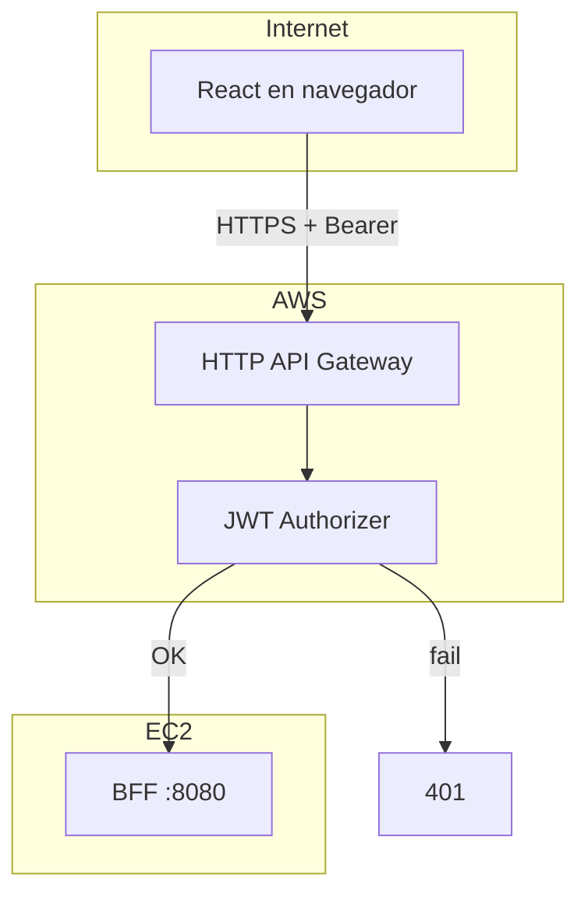

# Guía paso a paso — Ninna (API Gateway, versiones e identidad corporativa)

**Tu misión:** que **toda** la app en producción hable con AWS API Gateway (no con la IP del servidor); validar JWT; documentar v1 vs v2; definir la **marca visual** MesaTech.

**Bloques del plan:** B (Gateway), F (versionamiento), H (identidad corporativa).

**Estado EV1 / contingencia (Nico asume Ninna):** [`../estado/ninna-ev1.md`](../estado/ninna-ev1.md) — orden de trabajo, nombres de capturas, Word, BFF `54.90.110.67:8080`.

---

## 0. Conceptos mínimos

| Concepto | En palabras simples |
| --- | --- |
| **API Gateway HTTP API** | Puerta de entrada en AWS: recibe HTTPS del navegador y reenvía al BFF. |
| **Ruta** | URL que expone el Gateway, ej. `GET /v1/solicitudes/mias`. |
| **Integración HTTP** | “Cuando llegue esta ruta, llama a `http://IP:8080/...`”. |
| **JWT Authorizer** | Filtro: sin token válido de Entra → **401** y no pasa al BFF. |
| **CORS** | Reglas para que el **navegador** permita que React (origen A) llame al Gateway (origen B). |
| **Issuer / Audience** | Datos que Ari te pasa; deben coincidir con Entra y Spring. |



---

## 1. Prerrequisitos (ideal) vs trabajo en paralelo (dummy)

**¿Puede Ninna avanzar sin Ari/Nico listos?** Sí, en buena parte. Lo que sigue es **viable** si luego **reconfiguras** issuer, audience e integración con valores reales (15–30 min).

| Fase | Depende de Ari/Nico | Qué usar mientras tanto |
| --- | --- | --- |
| Crear HTTP API, rutas, CORS, capturas de consola | No | Invoke URL real de AWS (ya es “real”) |
| Integración HTTP al BFF | Nico (ideal) | **`http://localhost:8080`** si Ninna levanta BFF en su PC, o URL **placeholder** `http://127.0.0.1:9999` solo para ver rutas creadas (fallará 502 hasta haber backend) |
| JWT Authorizer | Ari (ideal) | Issuer/audience **provisional** del tenant cuando existan, o [issuer de demo Microsoft](https://login.microsoftonline.com/common/v2.0) + audience UUID **ficticio** solo para practicar la pantalla (el token del equipo **no** validará hasta poner el Client ID real de la API) |
| Prueba 401 sin token | No | Funciona **ya** con Authorizer activo |
| Prueba 200 con JWT del equipo | Ari + backend | Bloqueada hasta issuer/audience correctos y BFF/Gateway integrados |
| Partes F + H (v1/v2 texto, marca) | No | 100 % en paralelo |

### Valores dummy (plantilla — reemplazar)

```text
# Cuando Ari entregue lo real, pegar en JWT Authorizer:
Issuer:     https://login.microsoftonline.com/<TENANT_ID>/v2.0
Audience:   <API_CLIENT_ID de api-cloud-native>

# Integración (cuando Nico entregue EC2):
Backend:    http://<IP_EC2>:8080
# Mientras tanto en tu laptop (Skarlet/Nico levantan BFF local):
Backend:    http://<TU_IP_LAN>:8080   ← solo si SG/firewall lo permiten; más fácil: probar integración después
```

### Orden recomendado si el equipo va retrasado

1. **H** identidad corporativa + borrador **F** (informe).
2. Crear **HTTP API**, **rutas**, **CORS**, adjuntar authorizer con issuer/audience **temporales**.
3. Documentar **401** sin token (evidencia EP1 parcial).
4. Cuando Ari pase tenant + API Client ID → **editar authorizer** (un clic).
5. Cuando Nico pase IP:8080 → **editar integraciones** → probar 200 con token de React.
6. Cambiar `REACT_APP_API_BASE_URL` al Invoke URL.

---

## 1b. Prerrequisitos mínimos para empezar hoy

| # | Necesitas | De quién | Obligatorio día 1 |
| --- | --- | --- | --- |
| 1 | `ENTRA_ISSUER_URI` + audience | Ari | No (dummy hasta tener) |
| 2 | URL BFF en EC2 | Nico | No (502 temporal OK) |
| 3 | Cuenta AWS | Equipo | **Sí** |
| 4 | Origen React | Equipo | **Sí** (`http://localhost:3000`) |

---

## PARTE B — API Gateway

### Paso B.1 — Entrar a AWS y crear HTTP API

| Sub | Acción | Detalle |
| --- | --- | --- |
| B.1.1 | Consola AWS → buscar **API Gateway** | Región acordada con Nico (ej. `us-east-1`) |
| B.1.2 | **Create API** → **HTTP API** → **Build** | No confundir con REST API antigua si el curso pide HTTP API |
| B.1.3 | Nombre | `mesatech-ev1` o similar |
| B.1.4 | Crear | Anotar **Invoke URL** (ej. `https://xxxx.execute-api.region.amazonaws.com`) → esto es `REACT_APP_API_BASE_URL` en AWS |

---

### Paso B.2 — Crear rutas (proxy al BFF)

El BFF ya expone rutas; el Gateway debe **reenviar** manteniendo path y método.

**Estrategia recomendada para principiantes:** rutas `$default` o prefijos amplios según consola (HTTP API permite `$default` route con `{proxy+}`).

| Ruta en Gateway (ejemplo) | Método | Integración backend (Nico confirma host) |
| --- | --- | --- |
| `/api/usuario` | GET | `http://<BFF>:8080/api/usuario` |
| `/v1/solicitudes` | GET, POST | `http://<BFF>:8080/v1/solicitudes` |
| `/v1/solicitudes/mias` | GET | `http://<BFF>:8080/v1/solicitudes/mias` |
| `/v1/solicitudes/{id}/estado` | PATCH | `http://<BFF>:8080/v1/solicitudes/{id}/estado` |
| `/v2/solicitudes/mias` | GET | `http://<BFF>:8080/v2/solicitudes/mias` |
| `/v1/catalogo` y subrutas | GET, POST, … | `http://<BFF>:8080/v1/catalogo...` |

| Sub | Acción |
| --- | --- |
| B.2.1 | **Routes** → **Create** por cada ruta o usar integración proxy `$default` |
| B.2.2 | **Integration type**: HTTP URL |
| B.2.3 | Probar que el path que llega al BFF es el mismo que en local |

---

### Paso B.3 — JWT Authorizer (Entra ID)

| Sub | Campo en AWS | Valor |
| --- | --- | --- |
| B.3.1 | Authorizer type | JWT |
| B.3.2 | **Issuer** | `https://login.microsoftonline.com/<TENANT>/v2.0` (de Ari) |
| B.3.3 | **Audience** | Client ID de `api-cloud-native` (de Ari) |
| B.3.4 | Identity source | `$request.header.Authorization` (habitual) |
| B.3.5 | Adjuntar authorizer | A **todas** las rutas de negocio (no necesariamente a `/public/hola` si existe y es demo pública — acordar con equipo) |

Microsoft publica claves en `https://login.microsoftonline.com/<tenant>/discovery/v2.0/keys` — AWS las usa para validar firma.

---

### Paso B.4 — CORS

| Sub | Configuración | Valor típico |
| --- | --- | --- |
| B.4.1 | **Allow origins** | `http://localhost:3000` + URL del front desplegado |
| B.4.2 | **Allow headers** | `Authorization`, `Content-Type` |
| B.4.3 | **Allow methods** | `GET`, `POST`, `PATCH`, `PUT`, `DELETE`, `OPTIONS` |
| B.4.4 | Guardar y desplegar stage | `$default` o `prod` |

---

### Paso B.5 — Pruebas (Postman o curl)

| # | Prueba | Cómo | Resultado esperado |
| --- | --- | --- | --- |
| 1 | Sin token | `GET https://<invoke-url>/v1/solicitudes/mias` | **401** |
| 2 | Token basura | Header `Authorization: Bearer abc` | **401** |
| 3 | Token válido | Obtener token desde React (Skarlet) o MSAL | **200** + JSON |
| 4 | CORS | Desde React apuntando a Gateway | Sin error CORS en consola F12 |

**Cómo obtener un token para Postman (sin programar):**

1. Login en React con Gateway como base URL (o temporalmente BFF solo para sacar token).
2. F12 → Network → request con Bearer → copiar token (**no** subir a Git).
3. O usar jwt.ms solo para **leer** claims, no compartir token en informe.

---

### Paso B.6 — Conectar el frontend

| Sub | Acción |
| --- | --- |
| B.6.1 | En build de demo: `REACT_APP_API_BASE_URL=https://<invoke-url>` |
| B.6.2 | Documentar en README / `.env.example` (placeholder, sin URL real en commit si el equipo prefiere) |
| B.6.3 | Avisar a Skarlet: URL + colección Postman exportada |

---

## PARTE F — Versionamiento v1 y v2

### Qué significa (sin jerga)

- **v1** y **v2** son dos “formas” de la **misma operación** (`mis solicitudes`).
- v1 devuelve una lista simple (compatibilidad).
- v2 devuelve la misma info **más** metadatos (`version`, `usuario`).

### Paso F.1 — Redactar para el informe

Copia y adapta este borrador:

```text
MesaTech expone GET /v1/solicitudes/mias y GET /v2/solicitudes/mias.

v1: respuesta JSON array de solicitudes (contrato estable).
v2: objeto { "version": "2", "usuario": "<oid o email>", "solicitudes": [ ... ] }.

Mantenemos v1 porque clientes o integraciones antiguas esperan el array directo.
v2 permite evolucionar la API sin romper v1 (requisito EP1).
```

### Paso F.2 — Evidencia

| Sub | Acción | Captura |
| --- | --- | --- |
| F.2.1 | Mismo usuario, mismo token | |
| F.2.2 | Llamar v1 y v2 (Postman o React) | Dos respuestas lado a lado |
| F.2.3 | Enviar texto + capturas a Skarlet | Capítulo informe “Versionamiento” |

---

## PARTE H — Identidad corporativa

### Objetivo visual

MesaTech Cloud debe verse como producto real de soporte TI (no pantalla genérica de login).

### Paso H.1 — Definir marca

| Elemento | Qué decidir | Ejemplo de entrega |
| --- | --- | --- |
| Nombre | MesaTech Cloud | Texto en logo |
| Tagline | Frase corta | “Soporte tecnológico centralizado” |
| Color primario | Hex | `#1e3a5f` |
| Color secundario / acento | Hex | `#0ea5e9` |
| Fondo y texto | Hex | Contraste legible (WCAG básico) |
| Error / éxito | Hex | Rojo/verde suaves |
| Tipografía | 1–2 fuentes | Ej. Inter + system-ui |

Herramientas gratuitas: Figma, Canva, Coolors.co para paleta.

### Paso H.2 — Logo / isotipo

| Sub | Acción |
| --- | --- |
| H.2.1 | Crear logo simple (iniciales MT + ícono soporte) |
| H.2.2 | Exportar **SVG** y **PNG** (512px) |
| H.2.3 | Variante claro/fondo oscuro si aplica |

### Paso H.3 — Entregar kit al repo (sin secretos)

Carpeta sugerida: `docs/assets/marca/`

| Archivo | Uso |
| --- | --- |
| `logo.svg` / `logo.png` | React, PPT |
| `guia-marca.md` | Tamaño mínimo logo, colores hex, fuentes |

Contenido mínimo de `guia-marca.md`:

```markdown
# MesaTech — guía rápida
- Primario: #......
- Secundario: #......
- Logo: no escalar por debajo de 32px de alto
- Fuente títulos: ...
- Fuente cuerpo: ...
```

### Paso H.4 — Coordinación

| Persona | Qué le pasas |
| --- | --- |
| **Skarlet** | Archivos + hex + fuentes → aplicar en `frontend/src/App.css`, favicon en `public/` |
| **Nico** | PNG/SVG para portada y diagramas de la **presentación** |

---

## Capturas para la rúbrica (paso a paso)

Reglas: [`COMO-HACER-CAPTURAS.md`](COMO-HACER-CAPTURAS.md).  
Cubre EP1 §12 (API Gateway), §14 (Gateway + versionamiento), §15 (Gateway 401, CORS, v1/v2) e identidad visual.

Entrega: `capturas/ninna/` → `NIN-01.png` … + borrador textual v1/v2.

| ID | Rúbrica / §15 | Qué demuestra |
| --- | --- | --- |
| NIN-01 | §12 HTTP API | API creada + **Invoke URL** |
| NIN-02 | §12 rutas | Rutas `/v1`, `/v2`, `/api/usuario` |
| NIN-03 | §12 integraciones | Backend apunta al BFF :8080 |
| NIN-04 | §12 JWT Authorizer | Issuer + Audience Entra |
| NIN-05 | §12 CORS | Orígenes, headers, métodos |
| NIN-06 | §15 Gateway sin JWT | **401** sin `Authorization` |
| NIN-07 | §15 JWT inválido | **401** con Bearer incorrecto |
| NIN-08 | §15 JWT válido | **200** vía Gateway (Postman o React) |
| NIN-09 | §15 CORS navegador | F12 sin error CORS contra Gateway |
| NIN-10 | §15 v1 y v2 | Dos respuestas `/v1/.../mias` y `/v2/.../mias` |
| NIN-11 | §14 versionamiento | Texto + capturas contrato distinto v2 |
| NIN-H1 | Informe marca | Paleta + logo en `guia-marca` o slide |

### NIN-01 — Crear HTTP API

| Paso | Acción |
| --- | --- |
| 1 | AWS Console → **API Gateway** → tu **HTTP API** |
| 2 | Captura **nombre**, **API ID**, **Invoke URL** (`https://....execute-api....amazonaws.com`) |
| 3 | Anotar Invoke URL para `REACT_APP_API_BASE_URL` |

---

### NIN-02 — Rutas

| Paso | Acción |
| --- | --- |
| 1 | Menú **Routes** |
| 2 | Captura listado con rutas de negocio (al menos `/v1/solicitudes/mias`, `/v2/solicitudes/mias`, `/v1/catalogo`) |
| 3 | Abrir **una** ruta → captura método + path |

---

### NIN-03 — Integración HTTP

| Paso | Acción |
| --- | --- |
| 1 | **Integrations** → seleccionar integración del BFF |
| 2 | Captura **Integration URL** (`http://<IP>:8080` o proxy) |
| 3 | Ocultar IP en presentación si el equipo prefiere; informe completo puede mostrar IP EC2 |

---

### NIN-04 — JWT Authorizer

| Paso | Acción |
| --- | --- |
| 1 | **Authorization** → JWT authorizer |
| 2 | Captura **Issuer URI** (tenant Entra) y **Audience** (Client ID API) |
| 3 | Captura rutas **attached** al authorizer |

---

### NIN-05 — CORS

| Paso | Acción |
| --- | --- |
| 1 | **CORS** en HTTP API |
| 2 | Captura **Allow origins** (`http://localhost:3000`, …) |
| 3 | Captura **Allow headers** (`Authorization`, `Content-Type`) y métodos |

---

### NIN-06 — Prueba 401 sin token (Postman)

| Paso | Acción |
| --- | --- |
| 1 | Postman → `GET https://<INVOKE_URL>/v1/solicitudes/mias` |
| 2 | **Sin** pestaña Authorization |
| 3 | Captura respuesta **401** + URL visible |

Apoya prueba §11 #2 y §15 “Gateway rechaza sin JWT”.

---

### NIN-07 — Prueba 401 JWT inválido

| Paso | Acción |
| --- | --- |
| 1 | Authorization → Bearer → texto `invalid` |
| 2 | Captura **401** |

Prueba §11 #3.

---

### NIN-08 — Prueba 200 con JWT válido

| Paso | Acción |
| --- | --- |
| 1 | Token de Skarlet/Ari (canal privado) o login React + copiar Bearer **solo local** |
| 2 | Postman con Bearer → `GET .../v1/solicitudes/mias` |
| 3 | Captura **200** + cuerpo JSON (sin pegar token en imagen: pestaña Authorization oculta o tachada) |

Prueba §11 #4.

---

### NIN-09 — CORS desde React

| Paso | Acción |
| --- | --- |
| 1 | React con `REACT_APP_API_BASE_URL` = Invoke URL |
| 2 | F12 → **Console** |
| 3 | Ejecutar acción que llame API |
| 4 | Captura: **sin** error tipo “blocked by CORS” |

Prueba §11 #6. Skarlet puede ser quien dispara la acción; Ninna captura o Skarlet comparte SKA-CORS.

---

### NIN-10 y NIN-11 — v1 vs v2

| Paso | Acción |
| --- | --- |
| 1 | Mismo Bearer válido |
| 2 | Postman `GET .../v1/solicitudes/mias` → captura cuerpo (lista) |
| 3 | Postman `GET .../v2/solicitudes/mias` → captura cuerpo (objeto con `version`, `usuario`, `solicitudes`) |
| 4 | Informe: párrafo F + ambas figuras lado a lado |

Prueba §11 #8 y §15 “v1 y v2 coexisten”.

---

### NIN-H1 — Identidad corporativa

| Paso | Acción |
| --- | --- |
| 1 | Captura paleta (Figma/Canva) o página `guia-marca.md` renderizada |
| 2 | Captura logo sobre fondo claro |
| 3 | Captura React **con** marca aplicada (cuando Skarlet integre) o mockup |

---

### Checklist capturas Ninna

- [ ] NIN-01 … NIN-11 (+ NIN-H1) en carpeta `E:\DOWNLOADS\MesaTech-EV1-Ninna\` (ver [`../estado/ninna-ev1.md`](../estado/ninna-ev1.md))
- [ ] Word generado: `MesaTech_EV1_Evidencia_Ninna_Gateway_Marca.docx`
- [ ] Postman: tokens tachados
- [ ] Borrador v1/v2 incluido en Word / informe
- [ ] 2–3 figuras para presentación (Nico): Gateway + 401 + v1/v2

---

## Checklist final Ninna

- [ ] HTTP API creada; Invoke URL anotada → `REACT_APP_API_BASE_URL`
- [ ] Rutas integradas al BFF `http://54.90.110.67:8080` (Nico EC2)
- [ ] JWT Authorizer con issuer/audience de Ari
- [ ] CORS probado desde React (NIN-09)
- [ ] Prueba 401 sin token (NIN-06) e inválido (NIN-07)
- [ ] 200 con JWT (NIN-08); v1/v2 (NIN-10, NIN-11)
- [ ] Kit marca: [`../../assets/marca/guia-marca.md`](../../assets/marca/guia-marca.md) + NIN-H1
- [ ] Diagrama NIC-10 actualizado con Invoke URL
- [ ] Repo: [`rutas-api-gateway-bff.md`](../rutas-api-gateway-bff.md) (listo); opcional rama `feature/ninna-gateway`

---

## Errores frecuentes

| Síntoma | Revisar |
| --- | --- |
| 401 con token “bueno” | Audience incorrecto en Authorizer |
| 502/503 desde Gateway | BFF caído, SG bloquea, URL integración mal |
| CORS en navegador | Origen exacto en CORS; falta OPTIONS |
| React sigue yendo a :8080 | `REACT_APP_API_BASE_URL` no actualizada + rebuild |

Glosario: [`../../glosario/README.md`](../../glosario/README.md).
