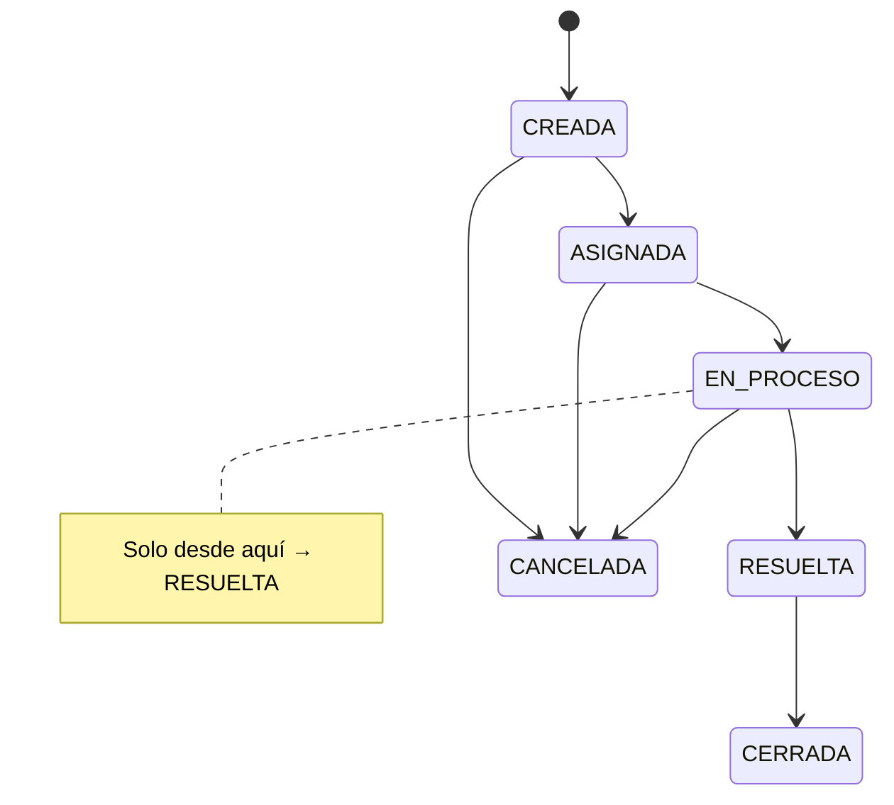

# Guía paso a paso — Skarlet (Negocio, UI, pruebas e informe)

**Tu misión:** que cliente, operador y administrador **vean y hagan cosas distintas**; completar pantallas React; ejecutar las **9 pruebas** y el flujo **E2E** de la EP1; integrar el **informe** y el checklist §15.

**Bloques del plan:** E (negocio y autorización), G (pruebas y entrega).

---

## 0. Conceptos mínimos

| Concepto | En palabras simples |
| --- | --- |
| **Autenticación** | ¿Quién eres? (login Entra) |
| **Autorización** | ¿Qué puedes hacer? (rol cliente/operador/admin) |
| **403 Forbidden** | Logueado pero **no permitido** (ej. cliente intenta ver todas las solicitudes) |
| **BFF** | Donde conviene poner reglas de rol antes de llamar a microservicios |
| **Estado de solicitud** | CREADA → … → CERRADA; regla EP1: RESUELTA solo desde EN_PROCESO |



---

## 1. Prerrequisitos

| # | Necesitas | De quién | Para qué |
| --- | --- | --- | --- |
| 1 | Usuarios Entra por rol | Ari | Probar 403 y UI |
| 2 | Cómo leer rol en JWT | Ari | Código en BFF |
| 3 | URL API Gateway | Ninna | Pruebas finales EP1 |
| 4 | EC2 estable | Nico | E2E en cloud |
| 5 | Kit visual (opcional al inicio) | Ninna | CSS/logo en `frontend/` |

Mientras tanto puedes desarrollar en local: `REACT_APP_API_BASE_URL=http://localhost:8080`.

Dominio de negocio: [`../../dominio/README.md`](../../dominio/README.md).

---

## PARTE E — Negocio y autorización

### Paso E.1 — Matriz de permisos (tu referencia)

| Acción | Cliente | Operador | Admin |
| --- | --- | --- | --- |
| Crear solicitud | Sí | Sí* | Sí* |
| Ver `/v1/solicitudes/mias` | Sí | Sí | Sí |
| Ver `/v1/solicitudes` (todas) | **No** | Sí | Sí |
| `PATCH .../estado` | **No** | Sí | Sí |
| CRUD catálogo | **No** | **No** | Sí |

\*Opcional según diseño del equipo.

---

### Paso E.2 — Implementar autorización en el BFF (orden sugerido)

| Sub | Tarea | Archivos típicos |
| --- | --- | --- |
| E.2.1 | Leer rol desde JWT | `JwtAuthenticationConverter` o claims en controller |
| E.2.2 | Crear helper `tieneRol("operador")` | paquete `bff/.../security` o similar |
| E.2.3 | En gateway controllers, antes de proxy | Si cliente llama `GET /v1/solicitudes` → **403** |
| E.2.4 | Catálogo POST | Solo admin → **403** para otros |
| E.2.5 | Probar con 3 usuarios | Postman o React |

**Ejemplo lógico (pseudocódigo):**

```text
GET /v1/solicitudes:
  if rol not in (operador, administrador) → 403

PATCH /v1/solicitudes/{id}/estado:
  if rol not in (operador, administrador) → 403

POST /v1/catalogo/categorias:
  if rol != administrador → 403
```

La regla **RESUELTA solo desde EN_PROCESO** vive en `ms-solicitudes` (ya esqueleto); verifica que devuelve error claro.

---

### Paso E.3 — Frontend React (pantallas mínimas)

Carpeta: `frontend/src/`

| Sub | Pantalla / comportamiento | Visible para |
| --- | --- | --- |
| E.3.1 | Login / logout (ya base MSAL) | Todos |
| E.3.2 | Mostrar **rol actual** y nombre | Todos |
| E.3.3 | Formulario **crear solicitud** | Todos autenticados |
| E.3.4 | Lista **mis solicitudes** | Todos |
| E.3.5 | Lista **todas** + filtro | Operador, admin (ocultar botón/menú a cliente) |
| E.3.6 | Selector **cambiar estado** | Operador, admin |
| E.3.7 | Sección **catálogo** CRUD | Solo admin |
| E.3.8 | Aplicar CSS/logo de Ninna | Todos |

| Sub | UX |
| --- | --- |
| E.3.9 | Si API responde 403, mensaje “No tienes permiso” |
| E.3.10 | No mostrar JSON crudo en producción demo |

Archivos clave existentes: `App.js`, `api/http.js`, `authConfig.js`.

---

### Paso E.4 — Demo “diferencias reales” (obligatorio EP1)

Graba capturas o tabla en informe:

| Usuario | Acción | Resultado esperado |
| --- | --- | --- |
| Cliente | Ver todas | 403 o UI oculta |
| Cliente | Cambiar estado | 403 |
| Operador | Ver todas | 200 + lista |
| Operador | Cambiar estado EN_PROCESO → RESUELTA | OK |
| Admin | Crear categoría | OK |
| Cliente | Crear categoría | 403 |

---

## PARTE G — Pruebas y entrega

Referencia oficial: [`../../caso/ep1-guia-oficial.md`](../../caso/ep1-guia-oficial.md) §10, §11, §15.

---

### Paso G.1 — Las 9 pruebas mínimas (ejecución + captura)

Reglas: [`COMO-HACER-CAPTURAS.md`](COMO-HACER-CAPTURAS.md). Ejecutar contra **Gateway** en entrega final.

| # | Prueba §11 | Owner captura principal | ID figura |
| --- | --- | --- | --- |
| 1 | Sin autenticación | Skarlet | SKA-T01 |
| 2 | Gateway sin token | Ninna (o Skarlet) | NIN-06 / SKA-T02 |
| 3 | JWT inválido | Ninna (o Skarlet) | NIN-07 / SKA-T03 |
| 4 | JWT válido | Skarlet | SKA-T04 |
| 5 | Autorización 403 | Skarlet | SKA-T05 |
| 6 | CORS | Skarlet + Ninna | SKA-T06 |
| 7 | Regla estado | Skarlet | SKA-T07 |
| 8 | v1 y v2 | Ninna + Skarlet | NIN-10 / SKA-T08 |
| 9 | Persistencia | Skarlet + Nico | SKA-T09 / NIC-06 |

#### SKA-T01 — Acceso sin autenticación

| Paso | Acción |
| --- | --- |
| 1 | React sin login (incógnito) |
| 2 | Intentar ver solicitudes o botón que dispare API protegida |
| 3 | Captura: UI pide login **o** error claro; **no** debe mostrarse data privada |

§15 ítem login implícito + prueba §11 #1.

#### SKA-T02 / T03 — 401 Gateway

Reutilizar **NIN-06** y **NIN-07** de Ninna o repetir en Postman y guardar como SKA-T02/T03 en informe (una sola figura por prueba).

#### SKA-T04 — JWT válido + API OK

| Paso | Acción |
| --- | --- |
| 1 | Login con usuario **operador** o **cliente** |
| 2 | F12 → **Network** → filtrar XHR |
| 3 | Clic acción permitida (ej. “Mis solicitudes”) |
| 4 | Captura fila: URL = **Invoke URL Gateway**, status **200** |
| 5 | Tachar header Authorization en recorte |

§12 “consumo API protegida desde React” + §14 MSAL + token.

#### SKA-T05 — 403 autorización

| Paso | Acción |
| --- | --- |
| 1 | Login como **cliente** |
| 2 | Intentar “Ver todas” o CRUD catálogo (UI o Postman con token cliente) |
| 3 | Captura **403** (Postman) o mensaje UI + Network 403 |
| 4 | Repetir captura con **operador** exitoso (contraste en informe) |

§11 #5 y §15 “diferencias por tipo usuario”.

#### SKA-T06 — CORS

| Paso | Acción |
| --- | --- |
| 1 | `REACT_APP_API_BASE_URL` = Gateway |
| 2 | F12 → **Console** |
| 3 | Llamada API exitosa **sin** texto `CORS policy` |
| 4 | Captura consola limpia + pestaña Network 200 |

#### SKA-T07 — Regla RESUELTA

| Paso | Acción |
| --- | --- |
| 1 | Solicitud en estado **CREADA** o **ASIGNADA** (no EN_PROCESO) |
| 2 | Operador intenta pasar a **RESUELTA** |
| 3 | Captura respuesta **4xx** + mensaje de negocio o UI error |

§11 #7.

#### SKA-T08 — v1 / v2

Usar capturas **NIN-10** o React/Postman lado a lado en una página del informe.

#### SKA-T09 — Persistencia

| Paso | Acción |
| --- | --- |
| 1 | Crear solicitud “Prueba persistencia EP1” |
| 2 | Captura lista con el ítem |
| 3 | Cerrar navegador / F5 |
| 4 | Captura **misma** solicitud visible |

Complemento **NIC-06** de Nico si el informe muestra también backend.

---

### Paso G.2 — Flujo E2E (12 pasos §10) — capturas obligatorias

Objetivo informe: narrar el flujo con **figuras SKA-E01 … SKA-E12** (o 4 collage de 3 pasos).

| Paso §10 | ID | Cómo capturar (paso a paso) | Figura de apoyo |
| --- | --- | --- | --- |
| 1 | SKA-E01 | Navegador en URL React (localhost o hosting) | — |
| 2 | SKA-E02 | Vista **no** autenticada + botón Iniciar sesión | — |
| 3 | SKA-E03 | Pantalla Microsoft login (Ari puede aportar ARI-07) | ARI-07 |
| 4 | SKA-E04 | React ya autenticado (nombre visible) | ARI-08 |
| 5 | SKA-E05 | F12 Network: request con Bearer (**tachado**) o MSAL silent success | SKA-T04 |
| 6 | SKA-E06 | Network: host = `execute-api.amazonaws.com` | SKA-T04 |
| 7 | SKA-E07 | Postman 401 sin token | NIN-06 |
| 8 | SKA-E08 | Ninna: integración Gateway→BFF o log BFF “incoming” | NIN-03 |
| 9 | SKA-E09 | curl 401 directo BFF | NIC-07 |
| 10 | SKA-E10 | Log MS o respuesta JSON con data de negocio | NIC-05 |
| 11 | SKA-E11 | NIC-06 persistencia o lista React tras refresh | SKA-T09 |
| 12 | SKA-E12 | UI final mostrando datos al usuario | SKA-T04 |

**Presentación (Nico):** usar solo SKA-E04, SKA-E06, SKA-T05, SKA-T09 (resumen).

---

### Capturas React + MSAL (bloque E — informe §12)

Además de las pruebas, incluir en capítulo React:

| ID | Contenido | Pasos |
| --- | --- | --- |
| SKA-UI01 | Pantalla principal marca Ninna | Login + logo |
| SKA-UI02 | Crear solicitud | Formulario + confirmación |
| SKA-UI03 | Lista “mías” | Cliente |
| SKA-UI04 | Lista “todas” | Operador (cliente oculto) |
| SKA-UI05 | Cambio estado | Operador, selector estados |
| SKA-UI06 | Catálogo admin | Solo admin |
| SKA-UI07 | Logout | SKA-E02 equivalente |

---

### Integrar capturas del equipo (tu rol como Skarlet)

| Carpeta | Integrar en capítulo informe |
| --- | --- |
| `capturas/ari/` | Cap. 2 Microsoft Entra ID |
| `capturas/ninna/` | Cap. 3 API Gateway + Cap. 8 v1/v2 + Marca |
| `capturas/nico/` | Cap. 4 EC2 + Cap. 5 Backend |
| `capturas/skarlet/` | Cap. 6–7 React, roles, pruebas §11, E2E |

Tabla maestra §15: columna **Figura** con ID (ARI/NIN/NIC/SKA).

---

### Paso G.3 — Informe pormenorizado (estructura sugerida)

| Capítulo | Responsable | Incluir |
| --- | --- | --- |
| 1. Introducción caso MesaTech | Skarlet | Contexto EP1 |
| 2. Microsoft Entra ID | Ari | Capturas + texto Ari |
| 3. API Gateway | Ninna | Rutas, Authorizer, CORS |
| 4. EC2 y PostgreSQL | Nico | Docker, JARs, SG |
| 5. Backend BFF + MS | Skarlet/Nico | Arquitectura sin BD en BFF |
| 6. React + MSAL | Skarlet | Login, token, pantallas |
| 7. Autorización y roles | Skarlet | Matriz + 403 |
| 8. Versionamiento v1/v2 | Ninna | Texto F + capturas |
| 9. Identidad corporativa | Ninna | Paleta/logo |
| 10. Pruebas §11 | Skarlet | Tabla 9 pruebas |
| 11. Conclusiones | Equipo | |

Formato: Word/Google Docs según indique el profesor.

---

### Paso G.4 — Checklist §15 (copiar y marcar)

Del [`../../caso/ep1-guia-oficial.md`](../../caso/ep1-guia-oficial.md):

- [ ] React login/logout Entra
- [ ] Access Token válido para API
- [ ] Front consume solo vía Gateway (entrega final)
- [ ] CORS OK
- [ ] Gateway rechaza sin JWT
- [ ] BFF revalida JWT
- [ ] BFF → MS, sin BD en BFF
- [ ] Dos MS persisten
- [ ] v1 + v2 coexisten
- [ ] Despliegue EC2
- [ ] Diferencias por tipo usuario
- [ ] Sin secretos en repo

Añade columna “Evidencia (pág./captura)”.

---

### Paso G.5 — Revisión anti-secretos (obligatorio)

| Sub | Acción |
| --- | --- |
| G.5.1 | `git status` — no `.env`, `.pem` |
| G.5.2 | Buscar en repo UUID tipo Entra del profesor |
| G.5.3 | Informe: tokens Bearer tachados |
| G.5.4 | Pedir a todos capturas **sin** passwords |

---

### Paso G.6 — Diagrama final

Actualizar [`../../arquitectura/diagrama.md`](../../arquitectura/diagrama.md) o PDF anexo:

```text
React (URL) → Gateway (invoke URL) → BFF (IP:8080) → MS (:8081/:8082) → Postgres
Entra (tenant) emite JWT validado en Gateway y BFF
```

---

## Coordinación con el equipo (calendario sugerido)

| Fase | Tú haces | Dependes de |
| --- | --- | --- |
| Semana 1 | UI local + autorización BFF en local | Ari (roles) |
| Semana 2 | Integrar Gateway URL | Ninna + Nico |
| Semana 3 | 9 pruebas + E2E + informe | Todos las capturas |
| Pre-presentación | Enviar prints a Nico | Ninna (marca) |

---

## Checklist final Skarlet

- [ ] Matriz permisos en BFF (403 demostrados)
- [ ] UI: crear, listar, estados, catálogo admin
- [ ] Tres usuarios demo documentados
- [ ] 9 pruebas ejecutadas: SKA-T01 … SKA-T09 (+ NIN/NIC donde corresponda)
- [ ] E2E: SKA-E01 … SKA-E12 (o collage documentado)
- [ ] SKA-UI01 … SKA-UI07 en informe
- [ ] Carpetas ari/ninna/nico integradas con pies de figura
- [ ] Checklist §15 con columna “Figura evidencia”
- [ ] Repo sin secretos; capturas sin Bearer completo
- [ ] Diagrama NIC-10 / SKA en anexo

---

## Si te bloqueas

| Problema | Dónde mirar |
| --- | --- |
| Rol no aparece en JWT | Ari — app roles asignados |
| Siempre 401 | Audience/scope; URL Gateway vs BFF |
| CORS | Ninna + consola navegador |
| Estado no cambia | `ms-solicitudes` logs; regla EN_PROCESO |

Guía local: [`../../onboarding/refs-y-entorno.md`](../../onboarding/refs-y-entorno.md) §6–7.
